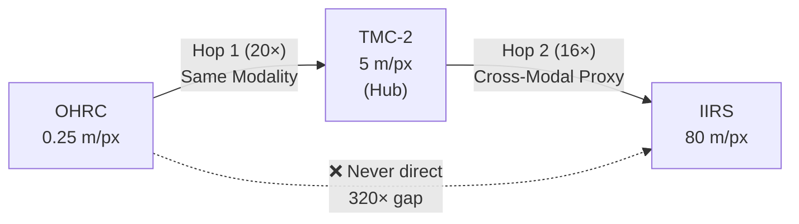

# TriNetra: SIH26166 Lunar Image Correspondence Pipeline

**Smart India Hackathon (SIH) 2026**
**Problem Statement:** SIH26166 - Multi-modal, Sun angle and scale invariant image correspondence using Chandrayaan-2 optical images (OHRC, TMC and IIRS).
**Team Lead:** Srijeet Prasad Banerjee

## Project Objective

An autonomous, end-to-end Python pipeline that establishes reliable image correspondence across three vastly different lunar instruments (OHRC, TMC-2, IIRS) onboard Chandrayaan-2. The pipeline is designed to overcome extreme scale gaps (up to 320x), multi-modal radiometric differences (visible to hyperspectral infrared), and severe sun-angle/illumination variances (equatorial overexposure vs. polar shadowing).

## Architecture: Hub-and-Spoke

Direct matching between OHRC (0.25 m/px) and IIRS (80 m/px) across a 320x scale gap is computationally unfeasible and highly error-prone. TriNetra utilizes a **Hub-and-Spoke Architecture** with TMC-2 as the anchor instrument:



- **Hop 1 (OHRC ↔ TMC-2):** Same-modality panchromatic matching across a 20× scale gap.
- **Hop 2 (TMC-2 ↔ IIRS):** Cross-modal matching across a 16× scale gap, using a PCA-derived 2D proxy of the IIRS hyperspectral cube.

## Ground Truth Instrument Specifications

- **OHRC:** 0.25 m/px nadir (0.32m oblique), 3 km swath, panchromatic visible 0.45-0.70 µm, 1 band, 12-bit.
- **TMC-2:** 5 m/px, 20 km swath, panchromatic 0.5-0.8 µm, 1 band, 12-bit.
- **IIRS:** 80 m/px, 20 km swath, hyperspectral infrared 0.8-5.0 µm, 256 bands, 12-bit.

## Pipeline Modules Implementation Status

### Phase 1: Data Mocking & Preprocessing (Completed)
Handles per-instrument radiometric correction, spectral dimensionality reduction, and coarse footprint-based search-space limiting.

- **`config/instrument_specs.py`**: Frozen dataclasses enforcing ground-truth instrument specifications and scale gaps.
- **`scripts/generate_mock_data.py`**: A robust synthetic data generator. Creates a shared 3D lunar terrain (heightmap, albedo, mineral map) and simulates Lambertian illumination with shadows. Generates geometrically consistent mock images for OHRC, TMC-2, and IIRS (256-band cube), along with SPICE-kernel-like metadata.
- **`src/module1_preprocessing/preprocessor.py`**: 
  - `OHRCPreprocessor`: Bilateral shadow-aware denoising to preserve crater rims, followed by adaptive CLAHE tuned for extreme contrast.
  - `TMC2Preprocessor`: Robust percentile-based contrast stretch and Gaussian denoising.
- **`src/module1_preprocessing/iirs_pca.py`**: Handles IIRS hyperspectral data. Performs band subsetting (0.8-2.5 µm), removes bad bands via variance thresholds, and applies PCA eigendecomposition to generate a high-contrast 2D panchromatic proxy image.
- **`src/module1_preprocessing/metadata_parser.py`**: Parses geometric metadata to compute selenographic bounding boxes, Haversine spatial overlaps, and pixel-space translation offsets.

### Phase 2: Hierarchical Hub Matching (Completed)
Implements the core hub-and-spoke matching orchestration with scale-aware handling and a tiered fallback mechanism.

- **`src/module2_matching/base_matcher.py`**: Defines the canonical `MatchResult` dataclass and `BaseMatcher` abstract class.
- **`src/module2_matching/scale_handler.py`**: 
  - `GaussianPyramid`: Builds anti-aliased multi-level downsampling pyramids.
  - `ScaleAligner`: Selects the appropriate pyramid level to align cross-GSD image pairs (e.g., matching 20x gap for OHRC-TMC2).
  - Coordinates remapping back to native resolution.
- **Tiered Matcher Architecture:**
  1. **`lightglue_matcher.py` (Primary):** Utilizes `kornia` and `torch` for SuperPoint feature extraction and LightGlue learned matching. Falls back to LoFTR if LightGlue is unavailable.
  2. **`orb_fallback_matcher.py` (Fallback):** Pure-OpenCV ORB + Hamming BFMatcher with Lowe's ratio test. Guarantees execution even in CPU-only, dependency-restricted environments.
- **`src/module2_matching/hub_matcher.py`**: The central orchestrator (`HubAndSpokeMatcher`). Routes OHRC↔TMC-2 to Hop 1 and TMC-2↔IIRS to Hop 2. Strictly enforces the hub constraint by raising errors on direct 320x OHRC↔IIRS attempts, requiring composite routing instead.

### Phase 3: Crater-Structural Verification (Upcoming)
- Integration of MINIMA/XoFTR-style cross-modal matching and crater structural verification.

### Phase 4 & 5: Registration and Visualization (Upcoming)
- MAGSAC++/RANSAC geometric registration.
- Confidence metrics and visual explainability outputs.

## Setup and Testing

**Requirements:**
`pip install -r requirements.txt`
Dependencies include `torch`, `kornia`, `opencv-python-headless`, `rasterio`, `numpy`, `scipy`, `pytest`.

**Running Tests:**
The pipeline is fully verified with 85 unit and integration tests covering both Phase 1 and Phase 2.
```bash
python3 -m pytest tests/ -v
```

## Repository Structure
```
TriNetra/
├── config/
│   ├── __init__.py
│   └── instrument_specs.py
├── scripts/
│   └── generate_mock_data.py
├── src/
│   ├── __init__.py
│   ├── module1_preprocessing/
│   │   ├── __init__.py
│   │   ├── preprocessor.py
│   │   ├── iirs_pca.py
│   │   └── metadata_parser.py
│   ├── module2_matching/
│   │   ├── __init__.py
│   │   ├── base_matcher.py
│   │   ├── scale_handler.py
│   │   ├── lightglue_matcher.py
│   │   ├── orb_fallback_matcher.py
│   │   └── hub_matcher.py
├── tests/
│   ├── __init__.py
│   ├── test_module1.py
│   └── test_module2.py
└── requirements.txt
```
>>>>>>> 03879f8 (Initial commit: Phase 1 & 2 implementation for TriNetra)
