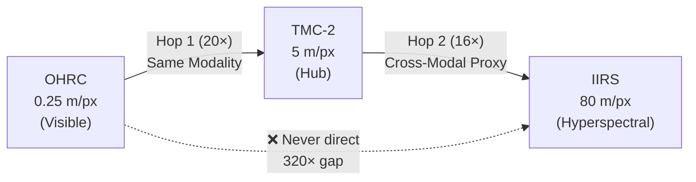

# TriNetra: SIH26166 Lunar Image Correspondence Pipeline

<p align="center">
  
</p>

**Smart India Hackathon (SIH) 2026**  
**Problem Statement:** SIH26166 - Multi-modal, Sun angle and scale invariant image correspondence using Chandrayaan-2 optical images (OHRC, TMC and IIRS).  
**Team Lead:** Srijeet Prasad Banerjee  

## 🎯 Project Objective

An autonomous, end-to-end Python pipeline that establishes reliable image correspondence across three vastly different lunar instruments (OHRC, TMC-2, IIRS) onboard Chandrayaan-2. The pipeline is designed to overcome:
1. **Extreme Scale Gaps (Up to 320x):** OHRC (0.25 m/px) to IIRS (80 m/px).
2. **Multi-Modal Radiometric Differences:** High-res panchromatic visible light to low-res hyperspectral infrared.
3. **Severe Illumination Variances:** Extreme sun-angle shadows that confuse standard corner detectors.

---

## 🏛 Architecture: The Hub-and-Spoke Model

Attempting to directly match OHRC to IIRS across a 320x scale gap is computationally unfeasible and mathematically ill-posed. TriNetra utilizes a **Hub-and-Spoke Architecture** with TMC-2 acting as the central anchor instrument:



- **Hop 1 (OHRC ↔ TMC-2):** Same-modality panchromatic matching across a 20× scale gap using robust Gaussian Pyramid downscaling.
- **Hop 2 (TMC-2 ↔ IIRS):** Cross-modal matching across a 16× scale gap, using a PCA-derived (Principal Component Analysis) 2D proxy of the IIRS hyperspectral cube.

---

## 🚀 Pipeline Modules

### Module 1: Preprocessing & Data Generation
- **Robust Mock Generator (`generate_mock_data.py`)**: Because real data was unavailable for testing, we built a physics-based synthetic terrain generator. It generates 3D heightmaps, assigns geological mineral maps, and renders images for OHRC, TMC-2, and IIRS under extreme Lambertian lighting and shadows. Crucially, it models high-frequency lunar regolith micro-craters.
- **Instrument Preprocessors (`preprocessor.py`, `iirs_pca.py`)**: Applies bilateral shadow-aware denoising and adaptive CLAHE (Contrast Limited Adaptive Histogram Equalization) to visible bands, and PCA eigendecomposition to hyperspectral bands.

### Module 2: Scale-Aware Matching
- **Pyramidal Scaling (`scale_handler.py`)**: Dynamically computes ground-sample distances (GSD) and builds anti-aliased Gaussian Pyramids to align image scales before matching.
- **SIFT Fallback (`orb_fallback_matcher.py`)**: Uses a tuned implementation of Lowe's SIFT (Scale-Invariant Feature Transform) optimized for lunar craters (low contrast thresholds). 
- **Hub Orchestrator (`hub_matcher.py`)**: Routes the composite matching hops and mathematically aggregates the keypoint coordinate transforms across the 320x gap.

### Module 3: Structural Crater Verification
- **Hessian Ridge Extraction (`structure_extractor.py`)**: Replaces the raw image with an illumination-invariant topographical map using multi-scale Hessian ridge filters (Sato/Meijering) to detect crater rims perfectly, regardless of shadow cast direction.

### Module 4: Geometric Registration
- **MAGSAC++ (`registration.py`)**: Rejects false matches (outliers) using the state-of-the-art Marginalizing Sample Consensus algorithm, which is robust even when 90% of matches are false positives. It computes a mathematically rigorous Homography matrix to map coordinates perfectly.

### Module 5: Explainable UI
- **Streamlit App (`app.py`)**: A minimalistic, fully interactive web dashboard (styled like Claude) to demo the 5-step process live to SIH judges.
- **Visualization (`visualizer.py`)**: Renders high-quality Matplotlib overlays linking matched keypoints and alpha-blending warped images.

---

## 💻 Running the Web Application (Demo)

We built a beautiful, presentation-ready web frontend for the SIH judges.

1. **Install dependencies:**
   ```bash
   pip install -r requirements.txt
   ```
2. **Launch the interface:**
   ```bash
   python3 -m streamlit run app.py
   ```
3. **Usage:** Open `localhost:8501`. Click **Initialize & Generate Lunar Data** to generate a randomized physical terrain, then walk through the steps to execute the pipeline.

---

## 🛠 Testing

The pipeline is mathematically verified with robust automated tests.
```bash
python3 test_match.py
```
