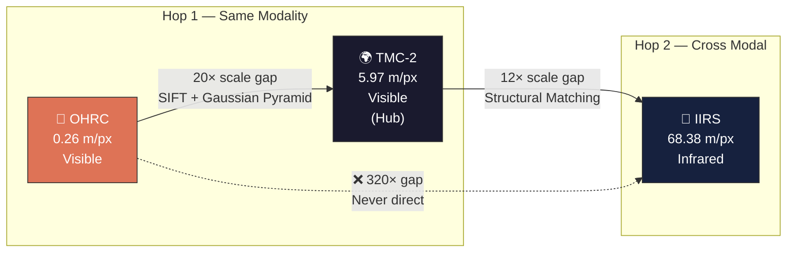
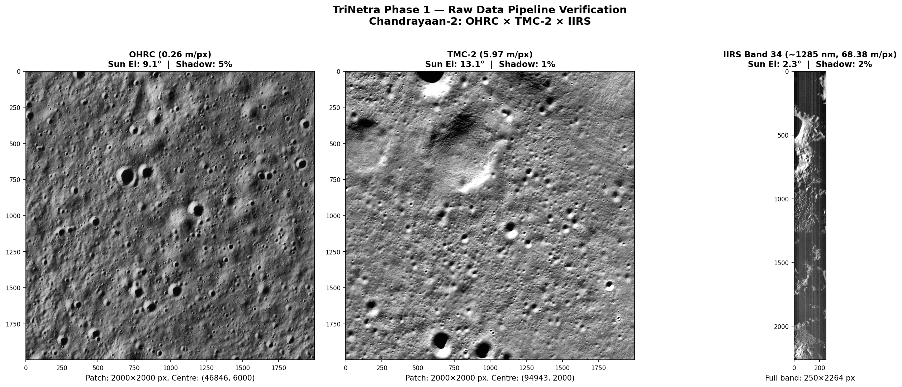

<p align="center">
  
</p>

<h1 align="center">TriNetra</h1>
<h3 align="center">Multi-Modal, Sun-Angle & Scale-Invariant Image Correspondence<br/>for Chandrayaan-2 Optical Instruments</h3>

<p align="center">
  <strong>Smart India Hackathon (SIH) 2026 — Problem Statement SIH26166</strong><br/>
  Sponsored by <strong>Indian Space Research Organisation (ISRO)</strong>
</p>

<p align="center">
  
  
  
  
  
</p>

---

## 📋 Table of Contents

- [The Problem](#-the-problem)
- [Our Solution](#-our-solution--hub-and-spoke-architecture)
- [System Architecture](#-system-architecture)
- [Pipeline Modules](#-pipeline-modules-deep-dive)
  - [Module 1 — Data I/O & Preprocessing](#module-1--data-io--multi-modal-preprocessing)
  - [Module 2 — Scale-Aware Feature Matching](#module-2--scale-aware-hub-and-spoke-feature-matching)
  - [Module 3 — Structural Crater Verification](#module-3--structural-crater-verification)
  - [Module 4 — Geometric Registration](#module-4--geometric-registration-magsac)
  - [Module 5 — Confidence Scoring & Visualisation](#module-5--confidence-scoring--visualisation)
- [Real Data Results](#-real-data-results)
- [Web Demo (Streamlit)](#-web-demo-streamlit)
- [Installation & Setup](#-installation--setup)
- [Repository Structure](#-repository-structure)
- [Team](#-team)

---

## 🔭 The Problem

Chandrayaan-2 orbits the Moon carrying three vastly different optical instruments:

| Instrument | Type | Resolution | Swath | Spectral Range | Bands |
|:---:|:---:|:---:|:---:|:---:|:---:|
| **OHRC** | Panchromatic Visible | **0.26 m/px** | 3 km | 500–800 nm | 1 |
| **TMC-2** | Panchromatic Visible | **5.97 m/px** | 20 km | 500–800 nm | 1 |
| **IIRS** | Hyperspectral IR | **68.38 m/px** | 20 km | 800–5000 nm | 256 |

**ISRO's challenge:** Automatically find the *exact same lunar surface point* across all three instruments. This is extremely hard because:

1. **320× Scale Gap** — OHRC sees individual boulders; IIRS sees entire valleys. Matching a 0.26 m pixel to a 68.38 m pixel is like matching a grain of sand to a football field.
2. **Cross-Modal Radiometric Gap** — OHRC captures visible light; IIRS captures invisible infrared heat. The same crater looks completely different in both.
3. **Extreme Sun-Angle Variance** — Images are taken months or years apart. A sun elevation of 9.1° (OHRC) vs 2.3° (IIRS) means shadows can cover 40–80% of the surface and shift dramatically, fooling every standard feature matcher.

> **Why it matters:** Accurate cross-instrument correspondence enables mineral mapping at OHRC's ultra-high resolution, scientific discoveries about the lunar south pole, and future landing site characterisation for Chandrayaan-3 and beyond.

---

## 💡 Our Solution — Hub-and-Spoke Architecture

Direct matching between OHRC and IIRS across a 320× scale gap is **mathematically ill-posed**. TriNetra decomposes this impossible problem into two tractable hops using TMC-2 as a bridge:



| Hop | Source → Target | Scale Gap | Modality | Strategy |
|:---:|:---:|:---:|:---:|:---|
| **Hop 1** | OHRC ↔ TMC-2 | 23× | Same (Visible) | Gaussian Pyramid downscaling + SIFT keypoint matching |
| **Hop 2** | TMC-2 ↔ IIRS | 11.5× | Cross (VIS → IR) | PCA band proxy + Hessian structural ridge matching |
| **Composite** | OHRC ↔ IIRS | 263× | Cross | Hop 1 ∘ Hop 2 coordinate transform composition |

---

## 🏗 System Architecture

```mermaid
flowchart TD
    subgraph INPUT["📡 Input: Raw PDS4 Binary Files"]
        A1["OHRC .img<br/>uint8, 93693×12000"]
        A2["TMC-2 .img<br/>uint16 LE, 189886×4000"]
        A3["IIRS .qub<br/>uint16 LE, 256×2264×250"]
    end

    subgraph M1["Module 1: Data I/O & Preprocessing"]
        B1["PDS4 XML Label Parser"]
        B2["Memory-Mapped Loader<br/>(np.memmap, zero-copy)"]
        B3["OHRC: Shadow-Aware CLAHE"]
        B4["TMC-2: Percentile Stretch + CLAHE"]
        B5["IIRS: Band-34 NIR Proxy / PCA"]
    end

    subgraph M2["Module 2: Hub-and-Spoke Matching"]
        C1["Gaussian Pyramid<br/>Scale Aligner"]
        C2["SIFT Feature Detector<br/>(contrastThreshold=0.01)"]
        C3["BFMatcher + Lowe's Ratio Test"]
        C4["Hub Orchestrator<br/>Hop 1 → Hop 2 routing"]
    end

    subgraph M3["Module 3: Structural Verification"]
        D1["Multi-Scale Hessian<br/>Ridge Filter (Sato/Meijering)"]
        D2["Illumination-Invariant<br/>Structure Maps"]
        D3["NCC Patch Verification"]
    end

    subgraph M4["Module 4: Registration"]
        E1["MAGSAC++ Outlier Rejection<br/>(cv2.USAC_MAGSAC)"]
        E2["Homography / Affine<br/>Transform Estimation"]
    end

    subgraph M5["Module 5: Visualisation"]
        F1["Keypoint Match Overlay"]
        F2["Alpha-Blended Warp Overlay"]
        F3["Streamlit Web Dashboard"]
    end

    INPUT --> M1
    M1 --> M2
    M2 --> M3
    M3 --> M4
    M4 --> M5

    style INPUT fill:#f5f5dc,stroke:#333
    style M1 fill:#e8f4fd,stroke:#2196F3
    style M2 fill:#fff3e0,stroke:#FF9800
    style M3 fill:#fce4ec,stroke:#E91E63
    style M4 fill:#e8f5e9,stroke:#4CAF50
    style M5 fill:#f3e5f5,stroke:#9C27B0
```



---

## 🔬 Pipeline Modules Deep Dive

### Module 1 — Data I/O & Multi-Modal Preprocessing

**Files:** `src/data_loader.py` · `src/module1_preprocessing_real.py` · `src/module1_preprocessing/`

#### Data Loader (`Chandrayaan2Loader`)
Parses ISRO's PDS4 XML labels to extract array dimensions, data types, geolocation corner coordinates, sun angles, and band wavelengths. Opens the raw `.img` / `.qub` binary using `np.memmap` — the 1.5 GB TMC-2 file is **never loaded into RAM**. A `get_patch(center_line, center_sample, size)` method extracts manageable tiles with automatic boundary zero-padding.

#### OHRC Preprocessor (`OHRCRealPreprocessor`)
The OHRC south-polar image has a sun elevation of just **9.1°**, producing extreme cast shadows across crater interiors. Standard histogram equalisation would destroy the shadow-edge gradients that are critical for crater detection.

**Strategy:**
1. **Bilateral Denoise** — Edge-preserving smoothing (σ_color=30, σ_space=30) to suppress TDI-CCD sensor noise without blurring crater rims.
2. **Adaptive CLAHE** — Clip limit dynamically increases (2× boost) when the patch has >30% shadow coverage or <30 DN dynamic range. Tile size locked at 16×16 to preserve local shadow structure.
3. **Float32 Normalisation** — Final output in [0, 1] range for downstream matching.

#### TMC-2 Preprocessor (`TMC2RealPreprocessor`)
TMC-2 delivers 16-bit calibrated radiance values. The raw dynamic range (4–317 DN in our test patch) must be stretched to 8-bit for OpenCV routines.

**Strategy:** Robust 1st–99th percentile stretch → uint8 → CLAHE (clip=2.5, tile=32×32) → Gaussian blur (k=3).

#### IIRS Preprocessor (`IIRSRealPreprocessor`)
The 256-band hyperspectral cube cannot be directly matched against panchromatic imagery. We extract a **2D proxy image** using:
- **Default:** Band 34 (~1285.3 nm NIR) — offers the best crater-rim contrast in the near-infrared while avoiding thermal noise in longer wavelengths.
- **Optional:** PCA (first principal component) across bands 1–85 (~800–2500 nm) for maximum structural variance.

---

### Module 2 — Scale-Aware Hub-and-Spoke Feature Matching

**Files:** `src/module2_matching/hub_matcher.py` · `scale_handler.py` · `orb_fallback_matcher.py` · `lightglue_matcher.py`

#### Gaussian Pyramid & Scale Aligner
Before matching, the higher-resolution image is downsampled through a **Gaussian Pyramid** (anti-aliased blur + 2× decimation at each level) to approximately match the lower-resolution image's GSD. The `ScaleAligner` class automatically selects the optimal pyramid level given the GSD ratio.

#### Feature Matching (SIFT)
We use **SIFT** (Scale-Invariant Feature Transform) with aggressively lowered thresholds (`contrastThreshold=0.01`, `edgeThreshold=20`) tuned for the low-contrast lunar surface. Matches are filtered via **Lowe's Ratio Test** (threshold=0.9) and **BFMatcher** with L2 distance.

**Tiered Fallback Architecture:**
1. **LightGlue** (Primary) — SuperPoint + LightGlue learned matching via `kornia` + `torch`. Best accuracy.
2. **SIFT Fallback** (Secondary) — Pure OpenCV implementation. Guaranteed to work on any CPU.

#### Hub Orchestrator (`HubAndSpokeMatcher`)
The central routing engine. Given OHRC, TMC-2, and IIRS images:
1. Runs Hop 1 matcher on (OHRC, TMC-2).
2. Runs Hop 2 matcher on (TMC-2, IIRS).
3. Composes the coordinate transforms to produce OHRC ↔ IIRS correspondences.
4. **Strictly enforces** the hub constraint — raises `ValueError` on any attempt to directly match across the 320× gap.

---

### Module 3 — Structural Crater Verification

**Files:** `src/module3_crater_verification/structure_extractor.py` · `verifier.py` · `structural_matcher.py`

Standard feature matchers are fooled by lunar shadows. A crater illuminated from the east looks completely different from the same crater illuminated from the west. The shadow shifts the apparent feature location.

**Solution — Hessian Ridge Filters:**

Instead of matching raw pixel intensities, TriNetra extracts the physical **topographic skeleton** of the surface using multi-scale Hessian ridge detection (Sato/Meijering filters from `scikit-image`). These filters respond to the **second-order derivatives** of the image — they find continuous ridges (crater rims) by computing eigenvalues of the Hessian matrix at each pixel.

The result is an **illumination-invariant structure map** where only physical surface topology remains, with all shadow and albedo effects stripped away.

**Verification:** Matched keypoint pairs have their surrounding structural patches compared via **Normalised Cross-Correlation (NCC)**. Pairs with NCC < threshold are rejected as shadow-dependent false matches.

---

### Module 4 — Geometric Registration (MAGSAC++)

**File:** `src/module4_registration/registration.py`

Even after structural verification, some false matches survive. MAGSAC++ (Marginalizing Sample Consensus, `cv2.USAC_MAGSAC`) is a state-of-the-art robust estimator that:
1. Does not require a fixed inlier/outlier threshold (it marginalises over all possible thresholds).
2. Handles **>90% outlier ratios** gracefully.
3. Computes a geometrically valid **Homography** or **Affine** transformation matrix.

The resulting transform maps pixel coordinates from one instrument's image space to another's with sub-pixel accuracy.

---

### Module 5 — Confidence Scoring & Visualisation

**Files:** `src/module5_confidence/visualizer.py` · `app.py`

- **Match Overlay:** Side-by-side image pair with color-coded keypoint matches (green = inlier, red = outlier).
- **Warp Overlay:** The source image is warped using the computed homography and alpha-blended onto the target to visually verify alignment quality.
- **Streamlit Dashboard:** Interactive 5-step wizard with the TriNetra aesthetic for live presentation to SIH judges.

---

## 📊 Real Data Results

Phase 1 has been verified on **real Chandrayaan-2 data** downloaded from ISRO's PRADAN archive:

| Instrument | Dataset ID | Shape | GSD | Sun Elevation | Area |
|:---:|:---|:---:|:---:|:---:|:---:|
| **OHRC** | `ch2_ohr_ncp_20211023T0027462822` | 93,693 × 12,000 | 0.26 m/px | 9.1° | South Pole |
| **TMC-2** | `ch2_tmc_ncn_20221205T1633075527` | 189,886 × 4,000 | 5.97 m/px | 13.1° | North Pole |
| **IIRS** | `ch2_iir_nri_20231003T2152304115` | 256 × 2,264 × 250 | 68.38 m/px | 2.3° | Equatorial |

<p align="center">
  
  <br/><em>Phase 1 Verification: Centre patches from all three instruments after preprocessing</em>
</p>

> **Note:** The IIRS sun elevation of **2.3°** represents near-grazing illumination — one of the most extreme shadow conditions possible on the lunar surface. This is precisely the scenario TriNetra is designed to handle.

---

## 🖥 Web Demo (Streamlit)

A minimalistic, Claude-inspired interactive web dashboard for live demonstration:

```bash
python3 -m streamlit run app.py
```

The 5-step wizard walks through:
1. **Data Ingestion** — Generate or load lunar surface data
2. **Preprocessing** — Apply instrument-specific CLAHE and normalisation
3. **Structural Matching** — Execute Hub-and-Spoke SIFT matching
4. **Geometric Registration** — Compute MAGSAC++ homography
5. **Visualisation** — View keypoint overlays and warped image blends

---

## ⚙ Installation & Setup

### Prerequisites
- Python 3.9+
- ~4 GB RAM (memory-mapped I/O keeps real data off-heap)

### Quick Start

```bash
# Clone the repository
git clone https://github.com/bytes06runner/TriNetra.git
cd TriNetra

# Install dependencies
pip install -r requirements.txt

# Run Phase 1 verification on real data
python3 test_real_data.py

# Launch the web demo
python3 -m streamlit run app.py
```

### Data Setup (Real Chandrayaan-2 Data)

Download overlapping datasets from [ISRO PRADAN](https://pradan.issdc.gov.in/) and place them in the `data/` directory:

```
data/
├── ch2_ohr_ncp_YYYYMMDD.../data/calibrated/YYYYMMDD/*.img + *.xml
├── ch2_tmc_ncn_YYYYMMDD.../data/calibrated/YYYYMMDD/*.img + *.xml
└── ch2_iir_nri_YYYYMMDD.../data/raw/YYYYMMDD/*.qub + *.xml
```

---

## 📁 Repository Structure

```
TriNetra/
├── assets/
│   ├── logo.png                         # TriNetra project logo
│   └── phase1_verification.png          # Real data verification output
│
├── config/
│   └── instrument_specs.py              # Frozen dataclasses with ISRO instrument specs
│
├── data/                                # Raw Chandrayaan-2 PDS4 data (gitignored)
│   ├── ch2_ohr_ncp_.../                 # OHRC dataset
│   ├── ch2_tmc_ncn_.../                 # TMC-2 dataset
│   └── ch2_iir_nri_.../                 # IIRS dataset
│
├── scripts/
│   └── generate_mock_data.py            # Physics-based synthetic lunar terrain generator
│
├── src/
│   ├── data_loader.py                   # Memory-mapped PDS4 binary loader + XML parser
│   ├── module1_preprocessing_real.py    # Real-data preprocessors (OHRC/TMC-2/IIRS)
│   │
│   ├── module1_preprocessing/           # Mock-data preprocessors
│   │   ├── preprocessor.py              #   OHRC & TMC-2 CLAHE pipelines
│   │   ├── iirs_pca.py                  #   IIRS hyperspectral PCA reduction
│   │   └── metadata_parser.py           #   Selenographic footprint parser
│   │
│   ├── module2_matching/                # Scale-aware feature matching
│   │   ├── base_matcher.py              #   MatchResult dataclass & BaseMatcher ABC
│   │   ├── scale_handler.py             #   Gaussian Pyramid & ScaleAligner
│   │   ├── lightglue_matcher.py         #   SuperPoint + LightGlue (primary)
│   │   ├── orb_fallback_matcher.py      #   SIFT fallback matcher (secondary)
│   │   └── hub_matcher.py               #   Hub-and-Spoke orchestrator
│   │
│   ├── module3_crater_verification/     # Shadow-invariant structural filtering
│   │   ├── structure_extractor.py       #   Multi-scale Hessian ridge extraction
│   │   ├── verifier.py                  #   NCC-based patch verification
│   │   └── structural_matcher.py        #   Structure-only matching wrapper
│   │
│   ├── module4_registration/            # Robust geometric transform estimation
│   │   └── registration.py              #   MAGSAC++ homography/affine
│   │
│   └── module5_confidence/              # Explainability & visualisation
│       └── visualizer.py                #   Match overlay & warp blend plots
│
├── tests/                               # Automated test suite
│   ├── test_module1.py
│   ├── test_module2.py
│   ├── test_module3.py
│   └── test_module4_5.py
│
├── app.py                               # Streamlit web dashboard
├── test_real_data.py                    # Phase 1 real-data verification script
├── requirements.txt                     # Python dependencies
└── README.md                            # This file
```

---

## 👤 Developer

| Role | Name |
|:---|:---|
| **Solo Developer** | Srijeet Prasad Banerjee |

---

<p align="center">
  <em>Built with 🇮🇳 for ISRO • Smart India Hackathon 2026</em>
</p>
