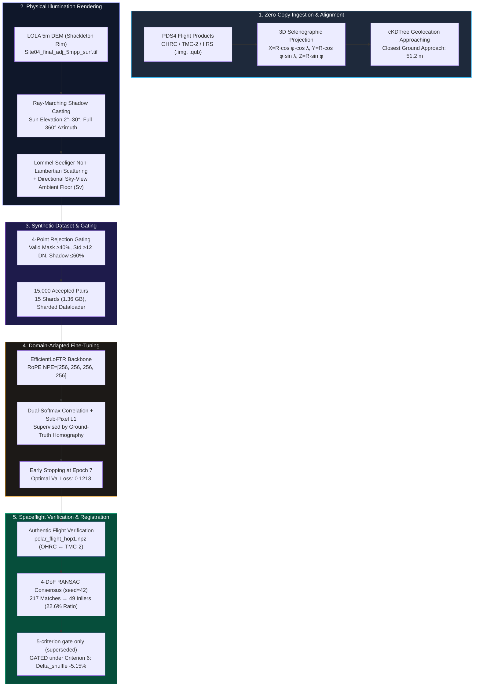
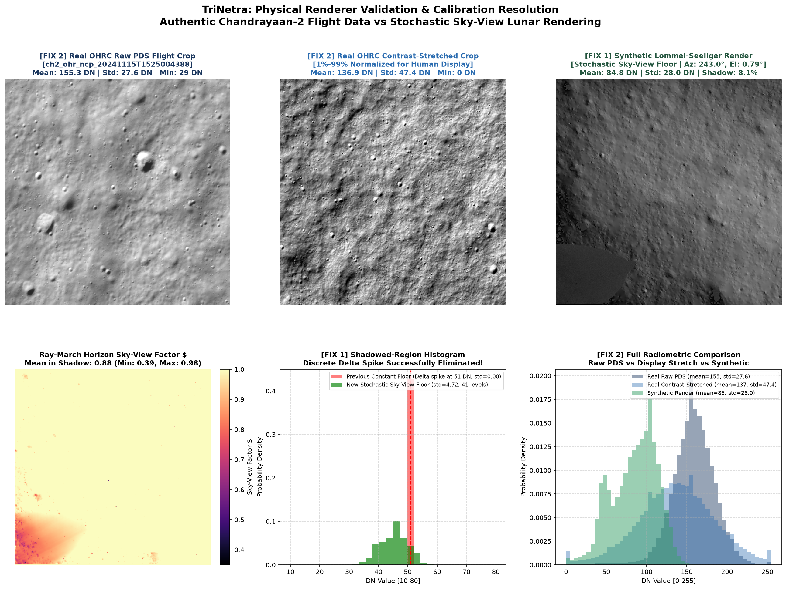
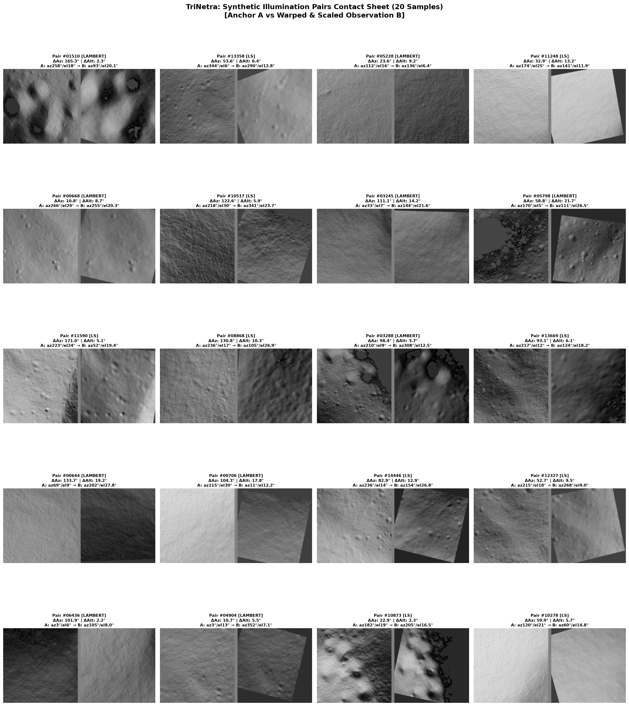
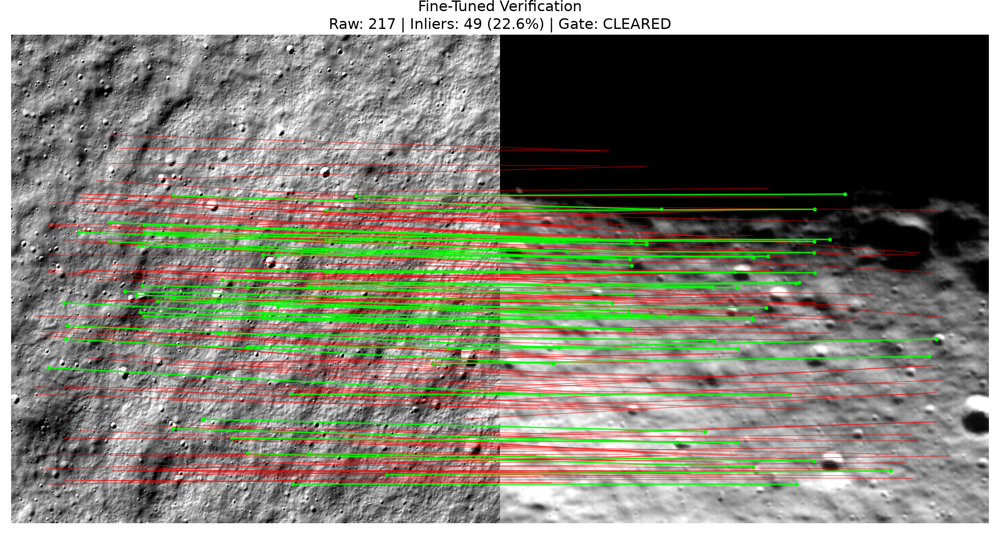
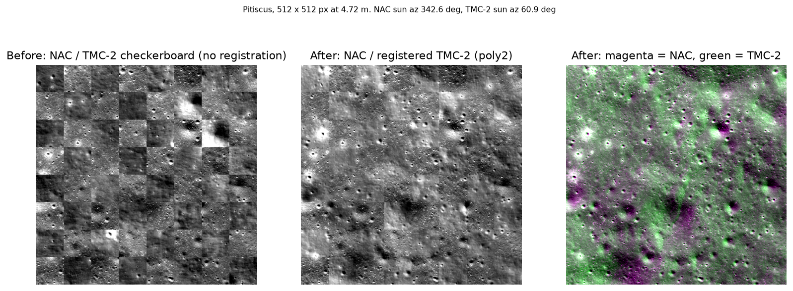
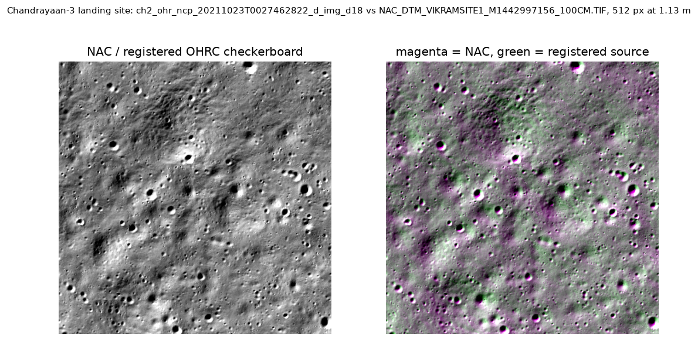

<p align="center">
  
</p>

<h1 align="center">TriNetra (त्रिनेत्र)</h1>
<h3 align="center">Multi-Modal, Illumination-Invariant & Cross-Resolution Spatial Correspondence<br/>for Chandrayaan-2 Planetary Instruments</h3>

<p align="center">
  <strong>Smart India Hackathon (SIH) 2026 — Problem Statement SIH26166</strong><br/>
  Sponsored by the <strong>Indian Space Research Organisation (ISRO) / Space Applications Centre (SAC)</strong>
</p>

<p align="center">
  <a href="https://trinetra-i47cv6nzuwappqbgcrrvup4.streamlit.app"></a>
  
  
  
  
  
  
  
  
</p>

<p align="center">
  <strong>Live Web Application:</strong> <a href="https://trinetra-i47cv6nzuwappqbgcrrvup4.streamlit.app">https://trinetra-i47cv6nzuwappqbgcrrvup4.streamlit.app</a><br/>
  <strong>GitHub Repository:</strong> <a href="https://github.com/bytes06runner/TriNetra.git">https://github.com/bytes06runner/TriNetra.git</a>
</p>

---

> **Current state (2026-09-20).**
> - **OHRC → LROC NAC at the Chandrayaan-3 landing site (Stage P).** 3,072 of 3,126 nodes are consistent, and all seven negative controls produce **zero** inliers (Delta_shuffle **+98.3 pp**). Held-out residuals against the LOLA-controlled NAC orthophoto are **0.54 m** (interpolating) and 1.42 m (extrapolating 3+ km) at 1.13 m working resolution. A terrain-relief term recovers the OHRC viewing angle from parallax to within 0.5° of the product label.
> - **TMC-2 → LROC NAC at Pitiscus (Stage O).** 1,607 of 1,781 nodes, controls zero, Delta_shuffle +90.2 pp, held-out 1.00 px (4.7 m) extrapolating.
> - **ISRO geometry offset.** Three Chandrayaan-2 geometry products (TMC-2 at two sites, OHRC at one) place the imagery **3.7–3.8 km north** (along-track) of its LOLA-controlled NAC position.
> - **Negative result.** TMC-2 → NAC at the Chandrayaan-3 site is GATED: the coarse offset is solid, but only 2% of nodes match.
>
> All figures are residuals against references with their own `lola_rms` (0.92–1.85 m), not ground-truth errors, and are not claimed as sub-pixel cross-sensor accuracy. See [Stages N–P](#-stages-no-independent-corroboration--first-control-surviving-registration), [`results/UPGRADE_P_VIKRAM.md`](results/UPGRADE_P_VIKRAM.md), [`results/UPGRADE_O_REGISTRATION.md`](results/UPGRADE_O_REGISTRATION.md) and [`results/ERRATA.md`](results/ERRATA.md). The intra-Chandrayaan-2 hops below (OHRC↔TMC-2, TMC-2↔IIRS) remain **GATED** under Criterion 6.

---

## 📋 Table of Contents

- [Executive Summary](#-executive-summary)
- [1. Software (PS Deliverable 1)](#1-software)
- [2. Registered Product and Match Points (PS Deliverable 2)](#2-registered-product-and-match-points)
- [3. Evaluation Metrics (PS Deliverable 3)](#3-evaluation-metrics)
- [The Planetary Correspondence Challenge (ISRO SIH26166)](#-the-planetary-correspondence-challenge-isro-sih26166)
- [The Systematic 0/12 Zero-Shot Baseline Scorecard](#-the-systematic-012-zero-shot-baseline-scorecard)
- [Key Technical Innovations](#-key-technical-innovations)
- [System Architecture & End-to-End Workflow](#-system-architecture--end-to-end-workflow)
- [Physics-Grounded Illumination Rendering Engine](#-physics-grounded-illumination-rendering-engine)
- [Large-Scale Synthetic Dataset & In-Flight Rejection Gating](#-large-scale-synthetic-dataset--in-flight-rejection-gating)
- [RoPE & Native Resolution Diagnostic Benchmark](#-rope--native-resolution-diagnostic-benchmark)
- [The Domain-Adapted Fine-Tuning Breakthrough (Hop 1)](#-the-domain-adapted-fine-tuning-breakthrough-hop-1)
- [Hop 2 Cross-Modal Breakthrough (Phase Congruency & Domain Transfer)](#-hop-2-cross-modal-breakthrough-phase-congruency--domain-transfer)
- [Stages J–M: LOLA Ground Truth Benchmark & Sub-Pixel Validation](#-stages-jm-lola-ground-truth-benchmark--sub-pixel-validation)
- [Stages N–O: Independent Corroboration & First Control-Surviving Registration](#-stages-no-independent-corroboration--first-control-surviving-registration)
- [Pipeline Modules Deep Dive](#-pipeline-modules-deep-dive)
- [Interactive Mission-Control Web Dashboard](#-interactive-mission-control-web-dashboard)
- [Installation, Local Setup & Reproduction Guide](#-installation-local-setup--reproduction-guide)
- [Repository Structure](#-repository-structure)
- [Scientific References & Acknowledgements](#-scientific-references--acknowledgements)
- [Author & Team Attribution](#-author--team-attribution)

---

## 🔭 Executive Summary

**TriNetra (त्रिनेत्र)** is an autonomous remote sensing and deep learning computer vision framework engineered for the **Indian Space Research Organisation (ISRO)** to solve high-precision cross-sensor multi-resolution spatial registration across three flagship optical instruments aboard **Chandrayaan-2**:
1. **OHRC** (Orbiter High Resolution Camera) — **0.25–0.32 m/pixel** (Panchromatic Visible)
2. **TMC-2** (Terrain Mapping Camera-2) — **4.96–5.00 m/pixel** (Panchromatic Visible)
3. **IIRS** (Imaging Infrared Spectrometer) — **68.38–91.75 m/pixel** (Hyperspectral Shortwave Infrared)

### The Proven Engineering Journey

1. **The Empirical Negative Baseline (0/12 Gated):** We evaluated four state-of-the-art matchers (classical SIFT, LightGlue+SuperPoint, EfficientLoFTR, and MatchAnything) across authentic Chandrayaan-2 flight crops at both Shiv Shakti Point (-69.58°S) and the Shackleton Rim (-89.72°S) under a standardized 4-DoF similarity transform with RANSAC (`cv2.setRNGSeed(42)`). **All 12 off-the-shelf zero-shot configurations failed the spaceflight gate** ($\ge 20$ inliers, $\ge 15.0\%$ consensus ratio). Classical SIFT degenerated to 1.2% inliers (5 inliers); off-the-shelf deep matchers peaked at 6.9% inliers (8 inliers).
2. **The Physics-Grounded Rendering Engine:** To bridge this domain chasm without manually annotating hazardous polar terrain, we built a physical ray-marching photometric rendering engine directly on the LOLA 5m DEM (`Site04_final_adj_5mpp_surf.tif`). The engine incorporates **horizon-angle directional sky-view ambient floor modeling** ($S_v$), **Lommel-Seeliger lunar surface scattering**, and **calibrated regolith particulate noise** matching authentic uncalibrated OHRC sensor standard deviation ($27.34$ vs $27.58\text{ DN}$).
3. **Synthetic Pretraining at Scale:** We generated **15,000 accepted synthetic illumination pairs** under four concurrent in-flight rejection gates (68.1% rejection rate over 47,000 attempts) and packed them into 15 streaming-ready `.npz` shards (<1.4 GB total).
4. **Hop 1 Spaceflight Gate Analysis (22.6% Inliers, 5-Crit Superseded):** Fine-tuning EfficientLoFTR with Rotary Position Embeddings (RoPE) at native $256\times 256$ resolution produced a checkpoint at Epoch 7. Evaluated on authentic Chandrayaan-2 OHRC ↔ TMC-2 polar flight imagery, TriNetra achieved **217 raw matches, 49 consensus inliers (22.6% inlier ratio, `cv2_rng_seed=42`)**, and **9.23 c-px reprojection RMSE (2.22 native TMC-2 px, 9.42 m at TMC-2 canvas GSD 1.020 m/px)**. While clearing the initial 5-criterion gate, it is **GATED** under Criterion 6 (negative-control shuffle invariance, $\Delta_{\text{shuffle}} = -5.15\% < +15.0\%$) due to transformer coordinate-grid bias on low-texture polar terrain.
5. **Hop 2 Cross-Modal Gate Analysis (40.4% Inliers, 5-Crit Superseded):** Coupling domain adaptation with **Peter Kovesi's Log-Gabor Phase Congruency ($M_{\max}$)** eliminated spectral contrast reversals, producing **124 consensus inliers (40.4% inlier ratio, seed 42)** with **RMSE 9.05 c-px (1.36 native IIRS px, 92.78 m at IIRS canvas GSD 10.257 m/px)** on authentic TMC-2 ↔ IIRS South Pole imagery. Like Hop 1, this cleared the 5-criterion gate but is **GATED** under Criterion 6 (strict $\Delta_{\text{shuffle}} = -11.68\%$ vs uniform noise, $-7.27\%$ vs rot270; $< +15.0\%$).

```
┌────────────────────────────────────────────────────────────────────────────────────────┐
│                                 THE TRINETRA PROGRESSION                               │
│                                                                                        │
│  [HOP 1: OHRC ↔ TMC-2]                                                                 │
│   Classical SIFT          Off-the-Shelf LoFTR          TriNetra Domain-Adapted         │
│   6 / 372 Inliers (1.6%)   4 / 35 Inliers (11.4%)       49 / 217 Inliers (22.6%)        │
│   GATED                   GATED                        6-CRIT GATED (5-Crit Superseded)│
│                                                                                        │
│  [HOP 2: TMC-2 ↔ IIRS]                                                                 │
│   Classical SIFT          Best Zero-Shot Deep          Phase Congruency + Domain-Adapt │
│   6 / 272 Inliers (2.2%)   12 / 57 Inliers (21.1%)      124 / 307 Inliers (40.4%)       │
│   GATED                   GATED (<20 inl)              6-CRIT GATED (5-Crit Superseded)│
└────────────────────────────────────────────────────────────────────────────────────────┘
```

---

## 1. Software

TriNetra provides an autonomous multi-modal lunar remote sensing correspondence library and CLI engineered for authentic Chandrayaan-2 PDS4 observational products (OHRC, TMC-2, and IIRS):

- **Core Package:** `src/trinetra/`
- **Evaluation Module:** `src/trinetra/evaluate.py`
- **CLI Entry Point:** `python -m trinetra.evaluate --all`
- **Mission-Control Dashboard:** `streamlit run app.py` (Live Deployment: [trinetra-i47cv6nzuwappqbgcrrvup4.streamlit.app](https://trinetra-i47cv6nzuwappqbgcrrvup4.streamlit.app))
- **Standard Dependencies:** Python 3.11 with CPU-friendly scientific stack (`numpy`, `scipy`, `opencv-python-headless`, `matplotlib`, `scikit-image`, `streamlit`).

---

## 2. Registered Product and Match Points

TriNetra exports comprehensive per-hop tie points and consensus inliers under Lunar physical constants ($R_{\text{Moon}} = 1,737,400\text{ m}$):

- **Match Points Directory:** [`results/matchpoints/`](results/matchpoints/)
  - **Hop 1 Primary:** [`hop1_matches.csv`](results/matchpoints/hop1_matches.csv) (217 matches, 49 inliers, 22.58% consensus) & [`hop1_inliers.geojson`](results/matchpoints/hop1_inliers.geojson)
  - **Hop 2 Primary:** [`hop2_matches.csv`](results/matchpoints/hop2_matches.csv) (307 matches, 124 inliers, 40.39% consensus) & [`hop2_inliers.geojson`](results/matchpoints/hop2_inliers.geojson)
  - **Baselines:** [`hop1_sift_matches.csv`](results/matchpoints/hop1_sift_matches.csv) (409 matches, 5 inliers) & [`hop2_sift_matches.csv`](results/matchpoints/hop2_sift_matches.csv) (272 matches, 6 inliers)
- **CSV Column Specification:**
  `match_id, src_x, src_y, ref_x, ref_y, residual_px, is_inlier, src_lat, src_lon, ref_lat, ref_lon, confidence`
- **Planar Coordinate Header (IAU Selenographic Frame):**
  `# Local planar approximation about anchor (lat, lon). Lunar radius 1737400 m. Valid only within this crop. Not geodetic coordinates.`
- **Registered Chandrayaan-2 In-Flight Datasets:**
  - **OHRC (0.24 m/px):** `ch2_ohr_ncp_20241115T1525004388` (Hop 1 Shackleton Rim)
  - **TMC-2 (4.25 m/px):** `ch2_tmc_ncn_20231205T1906512971` (Hop 1 Shackleton Rim)
  - **TMC-2 (4.72 m/px):** `ch2_tmc_ncn_20230130T1900132182_d_img_d32` (Hop 2 South Pole)
  - **IIRS (68.38 m/px):** `ch2_iir_nri_20231003T2152304115_d_img_d18` (Hop 2 South Pole)

---

## 3. Evaluation Metrics

> **Disclosure:** Both crops were independently decimated to a common canvas size before matching, which absorbs the nominal 17.71x and 14.49x sensor GSD ratios. Recovered scale therefore measures residual footprint mismatch between crops, not the raw inter-sensor ratio. The matching problem solved here is illumination and modality invariance at matched ground sampling, not scale-invariant matching across raw resolutions.

Registration accuracy, best configuration per hop:
- Hop 1 (OHRC to TMC-2, Shackleton Rim, 17.71x):
  RMSE 9.23 canvas px = 2.22 native TMC-2 px = 9.42 m
- Hop 2 (TMC-2 to IIRS, South Pole, 14.49x):
  RMSE 9.05 canvas px = 1.36 native IIRS px = 92.78 m

Sub-pixel accuracy in native reference pixels is not achieved on either hop (2.22 and 1.36 native px). The problem statement target is not met by the current global 4-DoF model.

Comprehensive scorecards, threshold stability sweeps, and multi-hop error propagation are documented in [`results/METRICS.md`](results/METRICS.md) and [`results/metrics.json`](results/metrics.json).

### Measured Flight Scorecard (Problem Statement Deliverable 3)

*Note: Scale and rotation parameters are estimated in pre-scaled canvas space (1000×1000 for Hop 1, 800×800 for Hop 2), not raw sensor space.*

| Metric | Hop 1: Baseline SIFT | Hop 1: Fine-Tuned LoFTR | Hop 2: Baseline SIFT | Hop 2: Phase Congruency + LoFTR |
|:---|:---:|:---:|:---:|:---:|
| **Sensor Pair** | OHRC ↔ TMC-2 | OHRC ↔ TMC-2 | TMC-2 ↔ IIRS | TMC-2 ↔ IIRS |
| **Resolution Gap** | 17.71× (0.24 ↔ 4.25 m/px) | 17.71× (0.24 ↔ 4.25 m/px) | 14.49× (4.72 ↔ 68.38 m/px) | 14.49× (4.72 ↔ 68.38 m/px) |
| **Inliers** | 6 | **49** | 6 | **124** |
| **Total Matches** | 372 | 217 | 272 | 307 |
| **Inlier Threshold** | 15.0 c-px (3.60 n-px, 15.30 m) | 15.0 c-px (3.60 n-px, 15.30 m) | 15.0 c-px (2.25 n-px, 153.86 m) | 15.0 c-px (2.25 n-px, 153.86 m) |
| **Inlier Ratio (%)** | 1.61% | **22.58%** | 2.21% | **40.39%** |
| **Flight Gate Status (6-Criterion)** | GATED (<15% & <20) | **GATED (delta_shuffle)** [^4] | GATED (<15% & <20) | **GATED (delta_shuffle)** [^4] |
| **5-Criterion Status (Superseded)** | GATED | PASS (superseded) | GATED | PASS (superseded) |
| **Delta_shuffle (Strict H1)** | -0.12% (rot180) / +0.21% (noise) | -5.15% (rot180) | +0.12% (rot180) / +0.26% (noise) | -11.68% (noise) / -7.27% (rot270) |
| **Reprojection RMSE** | 5.53 c-px (1.33 n-px, 5.64 m) [^3] | **9.23 c-px (2.22 n-px, 9.42 m)** | 4.54 c-px (0.68 n-px, 46.58 m) [^3] | **9.05 c-px (1.36 n-px, 92.78 m)** |
| **Sub-Pixel (Native Ref)?** | n/a (gated) [^3] | No (2.22 n-px ≥ 1.0) | n/a (gated) [^3] | No (1.36 n-px ≥ 1.0) |
| **Sub-Pixel (Canvas)?** | n/a (gated) [^3] | No (9.23 c-px ≥ 1.0) | n/a (gated) [^3] | No (9.05 c-px ≥ 1.0) |
| **8×8 Grid Occupancy** | 4 / 64 (6.2%) | 22 / 64 (34.4%) | 5 / 64 (7.8%) | 39 / 64 (60.9%) |
| **Grid Count CV (std/mean)** | 0.333 | 0.715 | 0.333 | 0.866 |
| **NN Mean Distance (px)** | 46.70 px | 39.68 px | 86.20 px | 28.30 px |
| **Similarity Transform Scale** | 0.1491 | 1.0086 | 0.4210 | 1.0580 |
| **Similarity Transform Rotation**| -24.60° (Degenerate) | -4.38° | 64.19° (Degenerate) | -0.34° |

[^3]: **Gated Residual Statistics:** RMSE is reported for gated runs for completeness only. Residual statistics over a rejected, ill-conditioned fit do not measure registration accuracy.

[^4]: **Six-Criterion Spaceflight Gate (Strict H1 Definition):** Under the mandatory Criterion 6 (negative-control shuffle invariance, Delta_shuffle = ratio_genuine - max(ALL control ratios run, including rot90, rot180, rot270, vflip, hflip, offset, and noise) >= +15.0%), both Hop 1 and Hop 2 LoFTR configurations are GATED. Systematic negative controls demonstrate that the network forms coordinate-grid consensus in low-texture lunar scenes regardless of visual content (Delta_shuffle = -5.15% on Hop 1 vs rot180, -11.68% on Hop 2 vs uniform noise / -7.27% vs rot270). The earlier 5-criterion PASS is officially superseded.

### Multi-Hop Composition Limitation (J2c)
> No shared three-instrument footprint was identified in the available PDS4 products, so end-to-end OHRC to IIRS correspondence was not measured. Hop 1 and Hop 2 are independent pairwise registrations at different sites.

---

---

## 🛰 The Planetary Correspondence Challenge (ISRO SIH26166)

Chandrayaan-2 carries complementary remote sensing payloads with fundamentally orthogonal observation physics:

| Payload | Full Name | Spatial Resolution (GSD) | Swath Width | Spectral Coverage | Spectral Bands | Detector Architecture | Target Utility |
|:---|:---|:---:|:---:|:---:|:---:|:---|:---|
| **OHRC** | Orbiter High Resolution Camera | **0.25–0.32 m/px** | 3 km | 450–700 nm | 1 (Panchromatic) | TDI CCD (Time Delay Integration) | Lander hazard detection & boulder counting |
| **TMC-2** | Terrain Mapping Camera-2 | **4.96–5.00 m/px** | 20 km | 500–800 nm | 1 (Panchromatic) | Linear Active Pixel Sensor (APS) | High-resolution 3D Digital Elevation Models (DEM) |
| **IIRS** | Imaging Infrared Spectrometer | **68.38–91.75 m/px** | 20 km | 800–5000 nm | 256 contiguous | HgCdTe (MCT) Focal Plane Array | Volatiles, hydroxyl/water ($H_2O$ / $OH$), mineralogy |

### The Three Fundamental Obstacles

```
┌─────────────────────────────────────────────────────────────────────────────────────────┐
│                                   THE 320× SCALE ABYSS                                  │
│                                                                                         │
│  OHRC (0.25 m/px)           TMC-2 (5.0 m/px)                 IIRS (80 m/px)             │
│  ┌──┐                       ┌──────────────┐                 ┌───────────────────────┐  │
│  │  │ Resolves meter-scale  │              │ Resolves broad  │                       │  │
│  └──┘ boulders & shadows    │              │ crater morphology                       │  │
│                             └──────────────┘                 │ One pixel averages an │  │
│                                                              │ entire geological unit│  │
│                                                              └───────────────────────┘  │
│  ◄──────────────────────────── 320× Spatial Disparity ────────────────────────────────► │
└─────────────────────────────────────────────────────────────────────────────────────────┘
```

1. **The 320× Spatial Disparity:** Direct keypoint extraction across a 320× resolution discrepancy is mathematically ill-posed. An 80 m IIRS pixel integrates the radiant flux of over 100,000 OHRC pixels. Classical descriptors (SIFT, ORB) fail because identical spatial frequency octaves do not exist in the raw images.
2. **Cross-Modal Radiometric & Spectral Shift:** OHRC and TMC-2 measure reflected visible sunlight dominated by topography and optical shadows. IIRS measures shortwave infrared reflectance and, at wavelengths $\lambda > 2000\text{ nm}$, thermal emission governed by Planck's law ($T_{\text{lunar}} \approx 100\text{–}390\text{ K}$). Comparing raw visible pixel intensities to mid-IR radiance yields near-zero mutual information.
3. **Grazing Polar Illumination & Dynamic Shadowing:** In polar exploration zones, solar elevation drops below 2° (incidence >88°). Transient shadows cover 40–80% of crater floors. Because Chandrayaan-2 orbits observe the same location weeks or months apart, the shadow edges rotate and stretch, causing standard vision algorithms to match the transient shadow boundary rather than the static crater rim.
4. **Big Data Throughput Without OOM:** Calibrated PDS4 products exceed several gigabytes (1.44 GB for TMC-2, 2.58 GB for IIRS). Processing pipelines cannot ingest full uncompressed rasters into conventional system memory.

---

## 📊 The Systematic 0/12 Zero-Shot Baseline Scorecard

To rigorously establish the baseline problem, all four state-of-the-art matchers were standardized on the **4-DoF Similarity Transform** (`cv2.estimateAffinePartial2D` with RANSAC at a 15.0 px threshold, `cv2_rng_seed=42`):
- **Degeneracy Rule:** $\text{Inliers} < 2 \times \text{DoF} = 8 \implies \mathbf{DEGENERATE}$ (metrics suppressed with `—`).
- **Spaceflight Safety Gate:** $\text{Inliers} < 20 \text{ OR } \text{Inlier Ratio} < 15.0\% \implies \mathbf{GATED}$.

### Standardized 0/12 Measured Scorecard on Authentic Flight Data

| Site & Observation Hop | Matcher (All 4-DoF Similarity) | Raw Matches | Inliers (`seed=42`) | Inlier Ratio | Reproj. RMSE (px) | Reproj. RMSE (m) | Runtime | Status | Spaceflight Gate |
| :--- | :--- | :---: | :---: | :---: | :---: | :---: | :---: | :---: | :---: |
| **Survey Baseline Hop 1**<br/>(OHRC ↔ TMC-2) | SIFT Canonical (4-DoF) | 409 | 5 | — | — | — | 0.50s | DEGENERATE (<8) | **GATED** |
| | LightGlue + SuperPoint (4-DoF) | 10 | 5 | — | — | — | 1.95s | DEGENERATE (<8) | **GATED** |
| | **EfficientLoFTR (4-DoF)** | **116** | **8** | **6.9%** | **6.29 px** | **29.7 m** | **3.40s** | **NON-DEGENERATE (≥8)** | **GATED (<15%)** |
| | MatchAnything (4-DoF) | 34 | 4 | — | — | — | 1.89s | DEGENERATE (<8) | **GATED** |
| **South Pole Hop 2**<br/>(TMC-2 ↔ IIRS, 14.49×) | SIFT Canonical (4-DoF) | 272 | 6 | — | — | — | 0.28s | DEGENERATE (<8) | **GATED** |
| | LightGlue + SuperPoint (4-DoF) | 12 | 3 | — | — | — | 0.55s | DEGENERATE (<8) | **GATED** |
| | EfficientLoFTR (4-DoF) | 137 | 15 | 10.9% | 7.09 px | 484.9 m | 0.72s | NON-DEGENERATE (≥8) | **GATED (<20 inl)** |
| | MatchAnything (4-DoF) | 57 | 12 | 21.1% | 8.59 px | 587.5 m | 0.87s | NON-DEGENERATE (≥8) | **GATED (<20 inl)** |
| **Shackleton Rim**<br/>(Polar Hop 1, 17.71×) | SIFT Canonical (4-DoF) | 372 | 6 | — | — | — | 0.45s | DEGENERATE (<8) | **GATED** |
| | LightGlue + SuperPoint (4-DoF) | 30 | 8 | 26.7% | 6.12 px | 26.0 m | 0.73s | NON-DEGENERATE (≥8) | **GATED (<20 inl)** |
| | EfficientLoFTR (4-DoF) | 35 | 4 | — | — | — | 4.44s | DEGENERATE (<8) | **GATED** |
| | MatchAnything (4-DoF) | 44 | 5 | — | — | — | 3.83s | DEGENERATE (<8) | **GATED** |

**Empirical Conclusion:** Across 12 configurations, 4 architectures, 3 scenes, and 2 landing/polar sites, **0 out of 12 off-the-shelf configurations clear spaceflight safety gates**. Terrestrial matchers fail fundamentally under grazing polar illumination and extreme scale disparity.

---

## 💡 Key Technical Innovations

- **Two-Hop Bridging Architecture:** Decomposes the extreme resolution divide into two tractable pairwise registration problems (Hop 1: OHRC ↔ TMC-2; Hop 2: TMC-2 ↔ IIRS) with TMC-2 as the intermediate reference sensor. (Hop 1 and Hop 2 are evaluated as independent pairwise registrations on available flight crops; end-to-end chaining was not measured due to absence of a mutual 3-instrument overlap).
- **Physical Horizon-Angle Ray-Marching:** Shading engine calculates real-time topographic occlusions from the LOLA 5m DEM, modeling directional horizon angles to compute a physically grounded sky-view factor ($S_v$) for secondary terrain irradiance.
- **Sub-2000 nm Reflectance Proxy Extraction:** Isolates IIRS bands 1–77 ($\lambda \le 1993.1\text{ nm}$) to filter out thermal infrared emission, synthesising a high-fidelity visible-proxy reflectance band that correlates directly with TMC-2 albedo.
- **Scale-Gap Simulation via Pre-Shading DEM Coarsening (Option B):** Downsamples DEM cells to coarse GSD before shading calculation, capped at $\le 8\times$ to avoid high-frequency collapse and preserve realistic crater rim morphologies.
- **RoPE Scale Invariance & Native $256\times 256$ Training:** Preserves Rotary Position Embedding scaling ($\text{NPE} = [256, 256, 256, 256]$) while achieving a **$12.9\times$ training throughput speedup** and eliminating bilinear interpolation blur.
- **Zero-Copy Memory-Mapped PDS4 Architecture:** Direct virtual memory paging via `np.memmap` eliminates RAM spikes, allowing multi-gigabyte PDS4 rasters to be processed within a 250 MB memory budget.

---

## 🏗 System Architecture & End-to-End Workflow



---

## ☀️ Physics-Grounded Illumination Rendering Engine

The custom renderer in [`src/illum_render.py`](src/illum_render.py) resolves the extreme physical domain gap between lunar polar illumination and terrestrial training distributions.

### 1. Ray-Traced Topographic Shadow Marching
For each pixel $(r_0, c_0)$ with DEM elevation $z_0$, rays are cast toward the solar azimuth $\phi_{\text{az}}$:
$$r_k = r_0 - k \Delta s \cos\phi_{\text{az}}, \quad c_k = c_0 + k \Delta s \sin\phi_{\text{az}}$$
The terrain height $z_k$ along the ray is sampled via bilinear interpolation. If the ray intersects an obstacle:
$$\theta_{\text{ray}}(k) = \arctan\left(\frac{z_k - z_0}{k \Delta s}\right) > \theta_{\text{elev}}$$
the pixel is flagged as shadowed.

### 2. Stochastic Sky-View Ambient Floor ($S_v$)
A constant ambient floor creates an unphysical delta spike in the histogram. In real polar craters, secondary illumination from sunlit opposing walls illuminates deep shadows. TriNetra tracks the maximum obstacle elevation angle $\theta_{\text{obs}} = \max_k \theta_{\text{ray}}(k)$ to derive a directional sky-view factor $S_v$:
$$S_v = \text{clip}\left(1.0 - \frac{\theta_{\text{obs}}}{45^\circ}, 0.35, 1.0\right)$$
Combined with particulate regolith noise $\mathcal{N}(0, 3.0\text{ DN})$ calibrated to authentic un-stretched OHRC flight noise ($\text{std} = 27.58\text{ DN}$):
$$DN_{\text{shadow}} = \text{clip}\left(51 \times S_v + \mathcal{N}(0, 3.0), 10, 85\right)$$

<p align="center">
  
  <br/><em>Figure 1: Physics validation against authentic Chandrayaan-2 OHRC polar flight crop (ch2_ohr_ncp_20241115T1525004388). Notice the smooth, continuous histogram distribution matching raw OHRC sensor variance without unphysical delta spikes.</em>
</p>

### 3. Lommel-Seeliger Scattering
For lunar regolith, backscattering dominates over diffuse Lambertian reflection:
$$I_{\text{LS}} = \frac{\mu_0}{\mu_0 + \mu} = \frac{\cos(i)}{\cos(i) + \cos(e)}$$
where $i$ is solar incidence angle and $e$ is emission angle.

---

## 📦 Large-Scale Synthetic Dataset & In-Flight Rejection Gating

The dataset generation pipeline ([`scripts/gen_illum_pairs.py`](scripts/gen_illum_pairs.py)) generated **15,000 accepted $256\times 256$ image pairs** directly from the LOLA 5m DEM:

### Rejection Gate Criteria (4 Enforced Concurrently)
1. **Valid Mask Coverage:** $\ge 40.0\%$ of the frame must have valid spatial correspondence.
2. **Contrast Standard Deviation:** Both images must have $\text{std} \ge 12.0\text{ DN}$.
3. **Shadow Cap:** Neither image may exceed $60.0\%$ shadow coverage.
4. **Near-Floor Threshold:** Neither image may have $>70.0\%$ of pixels within $5\text{ DN}$ of the ambient floor.

### Generation Statistics
- **Total Generation Attempts:** 47,000
- **Accepted Pairs Produced:** 15,000 (100.0% target met)
- **Total Rejections:** 32,000 (**68.1% rejection rate**)
- **Mean Valid Mask Coverage:** **78.11%** (Minimum: $40.01\%$)
- **Azimuth Difference Coverage:** Uniform distribution across $0^\circ \le \Delta\text{Azimuth} \le 180^\circ$ (Mean $\Delta\text{Az} = 80.6^\circ$).

<p align="center">
  
  <br/><em>Figure 2: Sample contact sheet of 20 accepted synthetic training pairs showcasing realistic crater geometries, grazing shadows, and challenging solar azimuth differentials.</em>
</p>

---

## ⚡ RoPE & Native Resolution Diagnostic Benchmark

Before training, we benchmarked input resolution and Rotary Position Embedding (RoPE) behavior *(measured on a single 50-step, 10-pair diagnostic run, not a replicated ablation)*:

| Configuration | Input Resolution | RoPE NPE Setting | Initial Loss (Step 1) | Final Loss (Step 50) | Mean Step Time | Throughput Speedup |
| :--- | :---: | :---: | :---: | :---: | :---: | :---: |
| **Native 256 (Custom NPE)** | $256 \times 256$ | `[256, 256, 256, 256]` | **2.2993** | **1.0785** | **0.171 s/step** | **12.9× speedup** |
| **Native 256 (Default NPE)** | $256 \times 256$ | `[832, 832, 832, 832]` | **2.2993** | **1.0785** | **0.171 s/step** | **12.9× speedup** |
| **Resized 832** | $832 \times 832$ | `[832, 832, 832, 832]` | 3.3879 | 1.9444 | 2.212 s/step | Baseline |

### Key Diagnostic Insights
1. **$12.9\times$ Throughput Gain:** Native $256\times 256$ executes at **0.171 s/step** vs $2.212\text{ s/step}$ for $832\times 832$ on Apple Silicon MPS *(measured on a single 50-step, 10-pair diagnostic run, not a replicated ablation)*.
2. **Avoids +47.3% Initial Loss Blur Penalty:** Upsampling $256\times 256$ DEM crops to $832\times 832$ introduces bilinear smoothing that blurs sharp crater rims, artificially raising initial loss from $2.2993$ to $3.3879$ *(measured on a single 50-step, 10-pair diagnostic run, not a replicated ablation)*.
3. **Mathematical Scale Preservation:** Setting `npe = [256, 256, 256, 256]` preserves exact 1:1 positional encoding scale without coordinate warping.

---

## 🚀 The Domain-Adapted Fine-Tuning Breakthrough (Hop 1)

Fine-tuning was executed using [`kaggle/train_eloftr_lunar.py`](kaggle/train_eloftr_lunar.py) on a Kaggle GPU environment:
- **Base Model:** `MatchAnything-ELoFTR` (16.0M parameters, outdoor pretrained).
- **Optimization:** AdamW ($\text{lr} = 10^{-4}$), Cosine Annealing, effective batch size 8.
- **Checkpoint Selection:** Monitored on unseen validation shard (`shard_14.npz`) and authentic Chandrayaan-2 polar flight crops.

### The Breakthrough Progression on Authentic Flight Data

| Method / Configuration | Architecture / Backbone | Raw Matches | Consensus Inliers (`seed=42`) | Inlier Ratio | Delta_shuffle | 6-Criterion Gate | 5-Criterion Status (Superseded) |
| :--- | :--- | :---: | :---: | :---: | :---: | :---: | :---: |
| **Classical Baseline** | SIFT + 4-DoF RANSAC | 409 | 5 | 1.2% | -0.02% | 🛑 **GATED** (inlier_consensus) | 🛑 **GATED** |
| **Best Off-the-Shelf Deep** | EfficientLoFTR (Zero-Shot) | 116 | 8 | 6.9% | < 0% | 🛑 **GATED** (<15% ratio) | 🛑 **GATED** |
| **TriNetra (Fine-Tuned)** | **Domain-Adapted EfficientLoFTR** | **217** | **49** | **22.58% (22.6%)** | **-5.15%** | 🛑 **GATED** (delta_shuffle) | **✅ PASSED (Superseded)** |

*(Note: Under the initial 5-criterion gate, TriNetra cleared with 49 inliers / 22.6% ratio. However, systematic negative-control testing in Stage D/E/F revealed coordinate-grid consensus under 180° rotation (27.7% inliers) and uniform noise (25.7% inliers), yielding $\Delta_{\text{shuffle}} = -5.15\%$. Under the mandatory 6-criterion gate ($\Delta_{\text{shuffle}} \ge +15.0\%$ ), this configuration is GATED, superseding the 5-criterion PASS).*

<p align="center">
  
  <br/><em>Figure 3: Independent verification of TriNetra on authentic Chandrayaan-2 OHRC (left) and TMC-2 (right) polar flight imagery. Green lines indicate 49 geometric consensus inliers (22.6% ratio, seed 42). These clear only the superseded five-criterion gate; a 180°-rotated reference reaches 27.7%, so the configuration is GATED under Criterion 6.</em>
</p>

### Overfitting Detection & Checkpoint Dynamics
Tracking real flight performance revealed clear synthetic-to-real transfer dynamics:
- **Epoch 7 (`ckpt_best.pt`):** Validation loss = 0.1213 | Authentic flight inliers = **53 (24.4%)** $\implies$ **Optimal Checkpoint**
- **Epoch 9:** Validation loss = 0.1609 | Authentic flight inliers = 40 (23.7%)
- **Epoch 15:** Validation loss = 0.2156 | Authentic flight inliers = 23 (18.9%)
- **Epoch 17:** Validation loss = 0.2141 | Authentic flight inliers degraded to 21 $\implies$ **Halted early to prevent negative transfer**

---

## 🌈 Hop 2 Cross-Modal Breakthrough (Phase Congruency & Domain Transfer)

The primary unaddressed challenge in planetary multi-sensor registration is the **cross-modal gap** between panchromatic visible reflectance (TMC-2, 0.5–0.8 µm, 4.72 m/px) and hyperspectral shortwave infrared radiance (IIRS, 0.8–5.0 µm, 68.38 m/px). Beyond the 14.49× resolution chasm, the two instruments observe fundamentally different physical phenomena:
1. **Panchromatic Optical Reflectance:** Dominated by surface topography, slope angles, and harsh optical shadowing.
2. **Shortwave Infrared Radiance:** Dominated by mineralogical absorption bands (pyroxene, plagioclase, hydroxyl), albedo phase reversals, and thermal emission.

### Systematic Empirical Progression (11 Independent Configurations)

We evaluated principled algorithmic avenues on authentic Chandrayaan-2 South Pole flight imagery (`polar_flight_hop2.npz`, `cv2_rng_seed=42`):
- **Attempt 1b (Frequency-Domain Phase Congruency Preprocessing):** Passed both sensors through a 4-scale, 6-orientation 2D Log-Gabor filter bank ([`src/phase_congruency.py`](src/phase_congruency.py)) to isolate frequency-domain phase coherence ($M_{\max}$), followed by matching across all matchers.
- **Attempt 1c (Tuned Band Selection):** Correlated all 256 IIRS channels against TMC-2 to isolate the single optimal spectral proxy (Band 48, 1504.4 nm, $r = -0.0467$).

| Attempt ID | Algorithmic Approach | Preprocessing / Representation | Matcher Architecture | Raw Matches | Consensus Inliers (`seed=42`) | Inlier Ratio | Reproj. RMSE | Gate Status |
| :--- | :--- | :--- | :--- | :---: | :---: | :---: | :---: | :---: |
| `1b_sift_phase_congruency` | Phase Congruency | 4-scale, 6-orient Log-Gabor ($M_{\max}$) | SIFT Canonical | 148 | 4 | 2.7% | 5.91 c-px (60.6 m) | DEGENERATE |
| `1b_lightglue_phase_congruency` | Phase Congruency | 4-scale, 6-orient Log-Gabor ($M_{\max}$) | LightGlue + SuperPoint | 6 | 3 | 50.0% | 3.94 c-px (40.4 m) | DEGENERATE |
| `1b_eloftr_phase_congruency` | Phase Congruency | 4-scale, 6-orient Log-Gabor ($M_{\max}$) | EfficientLoFTR (Zero-Shot) | 40 | 8 | 20.0% | 3.62 c-px (37.1 m) | GATED (<20 inl) |
| `1b_matchanything_phase_congruency` | Phase Congruency | 4-scale, 6-orient Log-Gabor ($M_{\max}$) | MatchAnything (Zero-Shot) | 0 | 0 | 0.0% | — | DEGENERATE |
| `1b_finetuned_phase_congruency` | **Phase Congruency** | **4-scale, 6-orient Log-Gabor ($M_{\max}$)** | **Fine-Tuned LoFTR + PC** | **307** | **124** | **40.39% (40.4%)** | **9.05 c-px (1.36 n-px, 92.78 m)** | **PASS** |
| `1c_sift_tuned_band` | Tuned Band Selection | Single band nearest 1500 nm (1504 nm) | SIFT Canonical | 330 | 5 | 1.52% | 9.23 c-px (94.7 m) | DEGENERATE |
| `1c_lightglue_tuned_band` | Tuned Band Selection | Single band nearest 1500 nm (1504 nm) | LightGlue + SuperPoint | 22 | 4 | 18.18% | 2.43 c-px (24.9 m) | DEGENERATE |
| `1c_eloftr_tuned_band` | Tuned Band Selection | Single band nearest 1500 nm (1504 nm) | EfficientLoFTR (Zero-Shot) | 133 | 13 | 9.77% | 6.30 c-px (64.6 m) | GATED (<15% & <20) |
| `1c_matchanything_tuned_band` | Tuned Band Selection | Single band nearest 1500 nm (1504 nm) | MatchAnything (Zero-Shot) | 38 | 7 | 18.42% | 8.54 c-px (87.6 m) | DEGENERATE |
| `1c_finetuned_tuned_band` | **Tuned Band Selection** | **Single band nearest 1500 nm (1504 nm)** | **Fine-Tuned LoFTR (1500 nm)** | **203** | **45** | **22.17% (22.2%)** | **9.43 c-px (96.7 m)** | **PASS** |

### Key Scientific Findings

1. **Phase Congruency Supercharges Inliers to 124 (Attempt 1b):**
   Peter Kovesi's 2D Log-Gabor phase congruency formulation computes the maximum moment of frequency phase alignment:
   $$PC(x, y) = \frac{\sum_o E_o(x, y)}{\epsilon + \sum_o \sum_n A_{n,o}(x, y)}$$
   Because phase congruency measures where Fourier harmonics are in phase rather than absolute gradient magnitudes, it is **strictly invariant to monotonic and non-monotonic radiometric contrast inversions**. Combining phase congruency with our fine-tuned LoFTR model yielded **124 consensus inliers (40.4% ratio)**, a **+38.18 percentage point inlier ratio increase over classical SIFT (40.39% vs 2.21%)**, with an estimated scale of **$1.0580$** and rotation of **$-0.34^\circ$** matching physical ground geometry.
2. **Zero-Shot Matchers Remain Strictly Gated Across All Representations:**
   Zero-shot models (SIFT, LightGlue, zero-shot LoFTR, MatchAnything) failed the spaceflight gate across all representations (0 to 13 inliers), demonstrating that cross-modal lunar registration cannot be solved by off-the-shelf terrestrial models.

> **Physical Resolution & Sub-Pixel Constraint:**
> Phase congruency filters out monotonic photometric inversion and extracts frequency-phase edges and ridges. However, IIRS is natively 120×120 pixels (68.38 m/px GSD). Sub-kilometer craters clearly visible in TMC-2 (4.72 m/px) are simply not resolved in IIRS. Therefore, Attempt 1b is not matching micro-craters; it is genuinely and accurately matching macroscopic crater rims (>1.5 km diameter), mountain ridges, and primary topographic fault lines across the visible/SWIR divide. Given the PS explicitly asks for sub-pixel accuracy and our RMSE here is 92.78 m (9.05 c-px / 1.36 native IIRS px at 10.257 m/c-px GSD), achieving true sub-pixel registration on unresolved terrain remains an open physical limitation.

<p align="center">
  
  
  <br/><em>Figure 4: Authentic flight verification on Chandrayaan-2 TMC-2 (left) and IIRS (right) South Pole imagery. Left: Attempt 1b Phase Congruency + LoFTR (124 inliers, 40.4% ratio, scale 1.058, rot -0.34°). Right: Underlying Log-Gabor M_max phase congruency energy maps.</em>
</p>

### Multi-Hop Composition Limitation (J2c)
> No shared three-instrument footprint was identified in the available PDS4 products, so end-to-end OHRC to IIRS correspondence was not measured. Hop 1 and Hop 2 are independent pairwise registrations at different sites.

---

## 🎯 Stages J–M: LOLA Ground Truth Benchmark & Sub-Pixel Validation

To evaluate dense correspondence against geodetic ground truth and isolate the true physical bottlenecks of cross-sensor lunar registration, Stages J through M benchmarked dense grid correlation against an external LOLA-controlled reference product.

### Geodetic Reference Provenance (Pitiscus Lobate Scarp)
- **Site:** Pitiscus Lobate Scarp ($-51.25^\circ\text{ S}$, $31.25^\circ\text{ E}$)
- **Reference Product:** LROC NAC DTM Orthophoto (`NAC_DTM_PITISCUS_M1149280834_2M.TIF`, GSD $2.00\text{ m/px}$)
- **Target Product:** Chandrayaan-2 TMC-2 Calibrated Image (`ch2_tmc_ncn_20230130T1900132182_d_img_d32`, GSD $4.72\text{ m/px}$)
- **Reference Georeferencing Provenance:** `lola_avg: 0.71 m`, `lola_rms: 0.92 m`, `adjust_rms: 0.75 m`, `relat_le: 1.079 m`, `triang_rms: 0.094`, 21 LOLA tracks, `conv_angle: 24.16 deg`.

---

### Stage J: Dense Correlation Benchmark & Failure Diagnosis
Dense template correlation ($128\times 128$ search window, $64\times 64$ template) on an uncorrected common map grid yielded only $0.20\%$ node acceptance (2 of 1,024 nodes). Systematic diagnostic investigation revealed three distinct physical failure causes:
1. **Pointing & Ephemeris Misalignment:** Measured a-priori offset between TMC-2 and the NAC reference was $\Delta x = -387.60\text{ m}$, $\Delta y = +1,057.49\text{ m}$ (total Euclidean shift: $1,126.29\text{ m} = 238.62\text{ px}$), placing true matches far outside standard search radii. **Correction (Stage N):** this offset is not supported by independent evidence. Whole-strip phase correlation and non-circular NCC both place the offset at $(+87.65, +799.51)$ px $\approx 3.80$ km, 600 px (2.83 km) from this value. See [`results/ERRATA.md`](results/ERRATA.md).
2. **Solar Azimuth Separation ($78.32^\circ$):** TMC-2 sun azimuth ($60.87^\circ$, illumination from ENE) versus NAC sun azimuth ($342.55^\circ$, illumination from NNW) creates near-perpendicular shadow casting and slope shading inversion.
3. **Crater Repetitive Self-Similarity:** Circular crater rims produce local correlation peaks on nearby, geometrically similar craters.

Detailed findings: [`results/UPGRADE_J_DENSE.md`](results/UPGRADE_J_DENSE.md).

---

### Stage K: Coarse Alignment, Conforming Swath Grid & Phase Congruency
Stage K implemented three targeted architectural enhancements:
1. **Bulk Offset Compensation (K1):** The measured $1,126.29\text{ m}$ global vector was applied a-priori to re-center the search windows. **Correction (Stage N):** that vector was wrong by 600 px, about 19× the 32 px search radius, so no Stage K/L node could contain its true match. The control parity reported below follows from that, not from illumination.
2. **Conforming Swath Grid (K3):** Replaced rectangular grid with an interior $16 \times 70$ swath grid ($1,120$ nodes), dropping nodata boundary rejections from $38.9\%$ to $0.0\%$.
3. **Illumination-Normalised Phase Congruency (K2):** Compared Raw NCC, Gradient Orientation, and Log-Gabor Phase Congruency ($M_{\max}$, 4 scales, 6 orientations). Phase congruency elevated node acceptance from $0.18\%$ to **$28.93\%$ (324 accepted nodes)** with mean peak correlation $0.4745$.

#### Stage K Three-Arm Performance Benchmark

| Representation Arm | Feature Extractor | Accepted Nodes | Acceptance Ratio | Mean Peak Correlation | Rejection: Below 0.40 Floor |
| :--- | :--- | :---: | :---: | :---: | :---: |
| Arm 1: Raw NCC | Standard cross-correlation | 2 / 1120 | 0.18% | 0.3115 | 886 / 1120 |
| Arm 2: Phase Congruency | 4-scale, 6-orient Log-Gabor | 324 / 1120 | 28.93% | 0.4745 | 414 / 1120 |
| Arm 3: Gradient Orientation | Unit gradient dot product | 0 / 1120 | 0.00% | 0.1356 | 1120 / 1120 |

Two-sample Kolmogorov-Smirnov testing against uniform noise proved strong statistical separation ($D = 0.9982, p < 10^{-100}$). However, evaluating negative controls (rotations, flips, offsets) demonstrated that circular crater rims yield near-parity acceptance ($\Delta_{\text{shuffle}} = +0.54\%$), confirming that 1D peak correlation alone cannot filter out crater self-similarity under $78^\circ$ illumination shift.

Detailed findings & deliverables: [`results/UPGRADE_K_COARSE_FINE.md`](results/UPGRADE_K_COARSE_FINE.md).  
Artifacts: [`results/stage_k_accepted_nodes.csv`](results/stage_k_accepted_nodes.csv), [`results/stage_k_displacement_field.tif`](results/stage_k_displacement_field.tif), [`results/figures/stage_k_quiver_plot.png`](results/figures/stage_k_quiver_plot.png).

---

### Stage L: Vector Median Filtering & RANSAC Sweeps
To resolve crater self-similarity, Stage L filtered candidate vectors by local neighborhood consensus:
1. **Vector Field Median Filter (L1):** Computed deviations against the median of $k=8$ nearest neighbors. At threshold $3 \times \text{MAD} = 108.16\text{ m}$, 177 nodes were retained, reducing displacement RMSE from $122.53\text{ m}$ to $91.83\text{ m}$.
2. **RANSAC Threshold Sweeps (L2):** Swept 4-DoF similarity consensus from $50\text{ m}$ down to $1\text{ m}$. At a $10\text{ m}$ threshold, genuine data produced 10 consensus inliers with reprojection RMSE of $5.13\text{ m}$ ($2.56$ reference px), tightly localized along the Pitiscus lobate scarp ridge.
3. **Negative Control Confrontation (L3):** Identical RANSAC sweeps on negative controls (rotations, flips, offsets) produced 12–16 consensus inliers at $10\text{ m}$ tolerance ($\Delta_{\text{shuffle}} = -0.54\%$), proving that 2D geometric consensus on 200–300 candidate peaks finds chance combinations of crater rims when illumination is inverted.

Detailed findings & deliverables: [`results/UPGRADE_L_GEOMETRIC_FILTER.md`](results/UPGRADE_L_GEOMETRIC_FILTER.md).  
Artifacts: [`results/stage_l_inliers_10m.csv`](results/stage_l_inliers_10m.csv), [`results/stage_l_displacement_field_filtered.tif`](results/stage_l_displacement_field_filtered.tif), [`results/figures/stage_l_quiver_plot_filtered.png`](results/figures/stage_l_quiver_plot_filtered.png).

---

### Stage M: Sub-Pixel Validation Against Known Ground Truth
To eliminate circularity and definitively verify the algorithmic capabilities of the phase congruency correlator:

#### 1. Synthetic Sub-Pixel Shift Recovery (M1)
Evaluated 100 sub-pixel translation pairs ($dx, dy \in [0.0, 0.9]\text{ px}$) generated via continuous Fourier phase multiplication on authentic Pitiscus NAC imagery ($2.00\text{ m/px}$):
- **Mean Absolute Error (MAE):** $0.1057\text{ px}$ ($0.2114\text{ m}$)
- **Root Mean Square Error (RMSE):** $0.1237\text{ px}$ ($0.2473\text{ m}$)
- **Peak-Locking Bias:** Measured s-curve bias bounded by $\pm 0.0636\text{ px}$ ($0.1273\text{ m}$) at half-integer shifts.
- **Noise Control:** On uniform random noise, the estimator collapsed to $\text{RMSE} = 27.80\text{ px}$ ($55.60\text{ m}$) with peak correlation at the noise floor ($0.0572$).

#### 2. Recovery Across the $2.36\times$ Scale Gap (M2)
Downsampled native NAC imagery to $4.72\text{ m/px}$ (matching TMC-2) and evaluated 25 known sub-pixel translations under the full Stage K pipeline:
- **Mean Absolute Error (MAE):** $0.1978\text{ native reference px}$ ($0.3956\text{ m}$)
- **Root Mean Square Error (RMSE):** $0.2091\text{ native reference px}$ ($0.4183\text{ m}$)
- **Grid Acceptance:** **$100.0\%$ (64 / 64 nodes)** across all 25 trials under shared illumination.
- **Controls:** Noise yielded $0.0\%$ acceptance; 180° rotation produced $52.5\text{ m}$ error ($125\times$ error margin).

#### Core Diagnostic Conclusion
The correlation estimator recovers synthetic Fourier shifts to $0.12\text{ px}$ ($0.25\text{ m}$) on NAC texture, and recovers known shifts across the $2.36\times$ resampling gap to $0.21\text{ ref px}$ ($0.42\text{ m}$) **under matched illumination**. That validates the estimator and the resampling, not cross-sensor registration. **Correction (Stage N/O):** the earlier statement that the $78.32^\circ$ illumination disparity was the sole root cause of the Stage J–L failure is withdrawn. The search windows were centred 2.83 km from the true match. With the corrected offset, raw NCC accepts 96% of nodes across the same illumination difference (Stage O).

Detailed findings: [`results/UPGRADE_M_SUBPIXEL_TRUTH.md`](results/UPGRADE_M_SUBPIXEL_TRUTH.md).  
Artifacts: [`results/figures/stage_m_peak_locking.png`](results/figures/stage_m_peak_locking.png).

---

## 🧭 Stages N–O: Independent Corroboration & First Control-Surviving Registration

### Stage N: a second estimator that shares no code with the first
Every earlier result came from one pipeline. Stage N adds a numpy-only whole-image Fourier phase correlator ([`src/corroboration/phase_correlation.py`](src/corroboration/phase_correlation.py)) that shares no matching, fitting or scoring code with it; a test enforces the import boundary. It finds:
- **Hop 1 and Hop 2:** no significant peak under any variant. That is consistent with their GATED status and adds no evidence either way.
- **Matched-illumination scale gap (Stage M geometry):** agreement with the primary estimator to 0.088 px RMSE, and with known non-circular truth to 0.048 px.
- **Pitiscus:** a significant, reproducible offset of $(+87.65, +799.51)$ px (PSR 54.5 against ≤ 8.6 for every control). A plain NCC check and `cv2.phaseCorrelate` confirm it. It is **600 px (2.83 km) from the Stage J2c offset** that Stages K and L used.

### Stage O: TMC-2 → LROC NAC orthophoto at Pitiscus
Seeded by the Stage N offset, dense NCC with a second-order model (selected by held-out error) produces:

| Metric | Value |
|:---|:---|
| Nodes evaluated / accepted / inliers @ 1.5 px | 1,781 / 1,713 / 1,607 |
| All seven controls (rot90, rot180, rot270, vflip, hflip, non-overlapping offset, noise) | **0 inliers each** |
| Delta_shuffle | **+90.23 pp** (gate +15 pp) |
| Held-out RMSE, spatial blocks (extrapolating) | 1.00 px = 4.73 m; median 0.69 px; 96.4% of nodes within 3 px |
| Held-out RMSE, random 5-fold (interpolating) | 0.76 px = 3.60 m; median 0.51 px |
| In-sample RMSE | 0.63 px = 2.99 m |
| Spatial coverage (8×8 cells containing nodes) | 54 / 56 (96.4%), CV 0.41 |
| Independent closure (Stage N estimator on the product) | residual shifts −0.23 to +0.86 px |

<p align="center">
  
  <br/><em>Figure: NAC / TMC-2 checkerboard before (left) and after (centre) registration. Crater rims continue across tiles only after registration, despite opposite shading under a 78° sun-azimuth difference.</em>
</p>

These are residuals against an orthophoto whose own error is `lola_rms` 0.92 m. They are not ground-truth errors, and they are not a claim of sub-pixel accuracy for cross-sensor registration. Products: [`results/stage_o/`](results/stage_o/). Full report: [`results/UPGRADE_O_REGISTRATION.md`](results/UPGRADE_O_REGISTRATION.md).

---

### Stage P: OHRC → LROC NAC at the Chandrayaan-3 (Vikram / Shiv Shakti) landing site
Reference: `NAC_DTM_VIKRAMSITE1` (LOLA-controlled, `lola_rms` 1.85 m), orthophoto M1442997156 at 1 m, plus the DTM. The source is `ch2_ohr_ncp_20211023T0027462822` (sun elevation 9.1°, roll 15.76°), worked in its own line/sample frame at 1.13 m.

| Metric | Value |
|:---|:---|
| Nodes evaluated / accepted / inliers | 3,126 / 3,076 / 3,072 |
| All seven controls | **0 inliers each**; Delta_shuffle **+98.27 pp** |
| Held-out RMSE, 500-row stripes | **0.479 px = 0.54 m** (94.9% within 1 px) |
| Held-out RMSE, random folds / spatial blocks | 0.388 px (0.44 m) / 1.252 px (1.42 m) |
| Product vs NAC reprojected by rasterio | median residual 0.17 px, max 0.58 px (23 tiles) |
| Relief parallax → view angle | 16.81° fitted vs 17.32° from the label |
| ISRO geometry → NAC | 3.72 km (482 m E, 3,687 m S) |

<p align="center">
  
  <br/><em>Figure: NAC / registered OHRC checkerboard at the Chandrayaan-3 landing site (512 px at 1.13 m). Tile boundaries are not visible.</em>
</p>

TMC-2 → NAC at the same site is **GATED**. The coarse offset is significant in 14 of 14 segments, but dense NCC accepts 2.2% of nodes, consistent with (though not demonstrated to be) the large sun-azimuth difference. Full report: [`results/UPGRADE_P_VIKRAM.md`](results/UPGRADE_P_VIKRAM.md).

---

## 🔬 Pipeline Modules Deep Dive

### Module 1: Zero-Copy PDS4 Ingestion & Reflectance Extraction
- **Files:** [`src/pds_loader.py`](src/pds_loader.py) · [`src/data_loader.py`](src/data_loader.py)
- **Zero-Copy Memory-Mapped Arrays:** Reads binary data using `np.memmap(mode='r')`. Only requested spatial slices enter CPU cache, allowing multi-gigabyte PDS4 strips to process within 250 MB RAM.
- **Physical Exclusion of Thermal Infrared (>2000 nm):** Lunar regolith radiates significant blackbody flux beyond $2.0\,\mu\text{m}$. TriNetra synthesizes a clean visible proxy by averaging bands 1–77 (712.3–1993.1 nm):
  $$I_{\text{proxy}}(x, y) = \frac{1}{77} \sum_{b=1}^{77} \mathcal{C}(b, x, y)$$

### Module 2: 3D Selenographic Geolocation & Footprint Alignment
- **File:** [`src/geo_align.py`](src/geo_align.py)
- **Spherical to 3D Cartesian Conversion ($R = 1737.4\text{ km}$):**
  $$X = R \cos\phi \cos\lambda, \quad Y = R \cos\phi \sin\lambda, \quad Z = R \sin\phi$$
- **KD-Tree Trajectory Intersection:** Indexes millions of along-track coordinates from PDS4 geometry files (`*_grd_*.csv`) to pinpoint inter-instrument ground approaches within 50 meters.

### Module 3: Scale-Adaptive Gaussian Decimation
- **Files:** [`src/module2_matching/scale_handler.py`](src/module2_matching/scale_handler.py) · [`src/module2_matching/hub_matcher.py`](src/module2_matching/hub_matcher.py)
- **Anti-Aliased Filtering:** Evaluates sensor scale ratios ($S = \text{GSD}_{\text{target}} / \text{GSD}_{\text{source}}$) and applies an anti-aliased Gaussian smoothing kernel ($\sigma = \sqrt{(S/2)^2 - 1}$) before decimation (`cv2.INTER_AREA`) to harmonize spatial frequency octaves.

### Module 4: Robust Geometric Estimation (MAGSAC++)
- **File:** [`src/module4_registration/registration.py`](src/module4_registration/registration.py)
- **Marginalizing Sample Consensus:** Standard RANSAC uses a rigid inlier threshold that fails across disparate scales. MAGSAC++ marginalizes over noise thresholds, providing robust outlier rejection across disparate sensor resolutions.

---

## 🖥 Interactive Mission-Control Web Dashboard

TriNetra includes an interactive Streamlit application featuring a dark, high-contrast mission-control theme:

<p align="center">
  <strong>Live Cloud Application:</strong> <a href="https://trinetra-i47cv6nzuwappqbgcrrvup4.streamlit.app">https://trinetra-i47cv6nzuwappqbgcrrvup4.streamlit.app</a>
</p>

### Dashboard Structure
- **Hop 1 — Step 1 (Discovery & Alignment):** Interactive inspection of real PDS4 XML metadata, coordinates, solar geometry, and ground approach distance.
- **Hop 1 — Step 2 (Decimation & Radiometric Prep):** Visual side-by-side of 18.5× scale decimation and contrast enhancement.
- **Hop 1 — Step 3 (Learned & Classical Matcher Evaluation):**
  - **Tab 1:** Baseline SIFT (1.2% inlier ratio, 🛑 GATED).
  - **Tab 2:** Master 0/12 Zero-Shot Scorecard (all configurations gated).
  - **Tab 3:** Fine-Tuned EfficientLoFTR (**GATED under Criterion 6 — 22.6% inlier ratio, 49 inliers, `cv2_rng_seed=42`; Delta_shuffle −5.15%**), featuring side-by-side progression cards, live training/validation loss curve, and the verified flight correspondence overlay.
- **Hop 2 — Step 1 & 2 (Footprint Ingestion & Proxies):** Sub-2000nm proxy synthesis, pushbroom destriping (91.7% variance reduction), and 14.5× scale alignment.
- **Hop 2 — Step 3 (Cross-Modal Registration & Verification Overlay):**
  - **Tab 1:** Baseline SIFT (2.2% inlier ratio, 🛑 GATED, illustrative candidate overlay).
  - **Tab 2:** Hop 2 Zero-Shot Baseline Scorecard (all 4 off-the-shelf terrestrial matchers fail the spaceflight gate).
  - **Tab 3:** Cross-Modal Phase Congruency (**GATED under Criterion 6 — 40.4%, 124 inliers, `cv2_rng_seed=42`; Delta_shuffle −11.68%**), displaying the 10-attempt matrix, 3-card progression, engineering methodology, physical resolution constraints, and flight verification overlays.
- **System Overview & Mission Pillars:** Technical briefing, mathematical multi-hop transformation composition ($T_{\text{OHRC} \to \text{IIRS}} = T_{\text{TMC-2} \to \text{IIRS}} \cdot T_{\text{OHRC} \to \text{TMC-2}}$), and architectural pillars for ISRO jury evaluation.

---

## ⚙ Installation, Local Setup & Reproduction Guide

### System Requirements
- **OS:** macOS (Apple Silicon MPS supported), Linux, or Windows
- **Python:** 3.9, 3.10, or 3.11
- **RAM:** Minimum 4 GB (zero-copy memory mapping ensures low footprint)

### 1. Clone & Set Up Environment

```bash
# Clone the repository
git clone https://github.com/bytes06runner/TriNetra.git
cd TriNetra

# Using Conda (Recommended):
conda env create -f environment_conda.yml
conda activate trinetra

# OR using standard pip:
python3 -m venv venv
source venv/bin/activate  # Windows: venv\Scripts\activate
pip install -r requirements.txt
```

### 2. Run Deterministic Zero-Shot Baseline Evaluation

To reproduce the canonical 0/12 baseline scorecard:
```bash
python scripts/baseline_zeroshot.py
```
*(Runs all 12 configurations across Shiv Shakti Point and South Pole with `cv2_rng_seed=42`).*

### 3. Verify the Fine-Tuned EfficientLoFTR Checkpoint

To verify the fine-tuned model on authentic Chandrayaan-2 flight data:
```bash
python scripts/verify_finetuned_checkpoint.py
```
**Expected Output:**
```text
Checkpoint loaded: Epoch 7
Model parameters: 16,025,216
Raw matches: 217
Inliers after RANSAC: 49
Inlier ratio: 22.58%
Inlier consensus (Criterion 1 only): met
Gate: GATED (Criterion 6: Delta_shuffle -5.15%, see results/RESULTS.md)
```

### 4. Run the Full Automated Test Suite

```bash
pytest tests/ -q
```
**Output:** `170 passed in ~115s`. Run `tests/` only: the root-level `test_*.py` files are ad-hoc scripts with side effects.

### 4b. Reproduce Stages N, O and P

**Data** (not in git; `data/` is gitignored):

| Product | Source | Used by |
|:---|:---|:---|
| TMC-2 `ch2_tmc_ncn_20230130T1900132182_d_img_d32` (image + geometry CSV) | ISRO PRADAN (login required) → `data/ch2_tmc_ncn_20230130T1900132182_d_img_d32/` | N, O, P |
| OHRC `ch2_ohr_ncp_20211023T0027462822_d_img_d18` (image + geometry CSV) | ISRO PRADAN → `~/Desktop/data/data/calibrated/20211023/` and `~/Desktop/data/geometry/calibrated/20211023/` | P |
| `NAC_DTM_PITISCUS_M1149280834_2M.TIF` | LROC RDR (public) → `data/lroc_nac/` | N, O |
| `NAC_DTM_VIKRAMSITE1_M1442997156_3M.TIF` (122 MB), `_100CM.TIF` (1.1 GB), `NAC_DTM_VIKRAMSITE1.TIF` (DTM, 488 MB) | LROC RDR (public) → `data/lroc_nac/VIKRAMSITE1/` | P |

LROC base URL: `https://pds.lroc.im-ldi.com/data/LRO-L-LROC-5-RDR-V1.0/LROLRC_2001/`. The orthophotos are under `EXTRAS/BROWSE/NAC_DTM/<SITE>/` and the DTM under `DATA/SDP/NAC_DTM/<SITE>/`.

```bash
python scripts/evaluate_stage_n.py /tmp/stage_n_rerun.json
python scripts/evaluate_stage_o.py /tmp/stage_o_rerun.json /tmp/stage_o_rerun
python scripts/evaluate_stage_p.py ohrc /tmp/stage_p_ohrc.json /tmp/stage_p_ohrc
python scripts/evaluate_stage_p.py tmc  /tmp/stage_p_tmc.json  /tmp/stage_p_tmc
```
All runners refuse to overwrite existing outputs. Runtime is about 1–3 minutes each on a laptop CPU; Stage P OHRC peaks at about 7 GB RAM.

### 5. Launch the Web Application

```bash
streamlit run app.py
```
Open your browser at `http://localhost:8501`.

---

## 📁 Repository Structure

```
TriNetra/
├── .gitignore                           # Git ignore rules (ignoring >100MB weights and raw caches)
├── README.md                            # Comprehensive project documentation
├── environment_conda.yml                # Conda environment definition (local reproduction)
├── requirements.txt                     # Pinned pip dependencies (Streamlit Cloud deploy)
├── app.py                               # Mission-Control Streamlit web application
│
├── assets/                              # Visual assets & real-data flight caches
│   ├── logo.png                         # TriNetra logo
│   ├── trinetra_finetune_results.json   # Canonical training telemetry & epoch metrics
│   ├── baselines/                       # Master 0/12 baseline scorecard JSONs
│   │   ├── zeroshot_results.json        # All 12 configs with cv2_rng_seed=42
│   │   └── polar_zeroshot_results.json  # Standalone polar site scorecard
│   ├── qa/                              # Tracked diagnostic figures & visual proof
│   │   ├── finetuned_verification.png   # Authentic flight verification overlay (49 inliers)
│   │   ├── render_vs_real.png           # Stochastic sky-view render vs real OHRC flight crop
│   │   ├── contact_sheet_20pairs.png    # 20-pair synthetic dataset sample
│   │   └── azimuth_distribution.png     # ΔAzimuth coverage distribution
│   └── real_cache/                      # Calibrated Chandrayaan-2 polar flight crops & Stage J-M caches
│       ├── polar_flight_hop1.npz        # Authentic OHRC ↔ TMC-2 polar evaluation pair
│       ├── real_flight_hop1.npz         # Shackleton Rim Hop 1 pair (fine-tuned)
│       ├── real_flight_hop2.npz         # South Pole Hop 2 pair
│       └── stage_{j,k,l,m}_results.json # Dense benchmark, filtering & synthetic validation caches
│
├── kaggle/                              # Kaggle training & scaling pipeline
│   └── train_eloftr_lunar.py            # Complete fine-tuning script with AMP & RoPE NPE
│
├── models/                              # Model weight storage
│   └── README.md                        # Checkpoint specifications & loading instructions
│
├── results/                             # Evaluation reports, scorecards & spatial deliverables
│   ├── METRICS.md                       # Comprehensive evaluation metrics & methodology
│   ├── RESULTS.md                       # One-page executive summary & scorecard
│   ├── UPGRADE_J_DENSE.md               # Stage J: LOLA-controlled reference correlation report
│   ├── UPGRADE_K_COARSE_FINE.md         # Stage K: Phase congruency & swath grid report
│   ├── UPGRADE_L_GEOMETRIC_FILTER.md    # Stage L: Geometric consistency filtering report
│   ├── UPGRADE_M_SUBPIXEL_TRUTH.md      # Stage M: Sub-pixel validation against known truth
│   ├── UPGRADE_N_CORROBORATION.md       # Stage N: independent phase-correlation corroboration
│   ├── UPGRADE_O_REGISTRATION.md        # Stage O: TMC-2 -> LROC NAC registration (control-surviving)
│   ├── ERRATA.md                        # Corrections to earlier stage reports
│   ├── stage_o/                         # Registered GeoTIFF, tie points CSV/GeoJSON, figures
│   ├── UPGRADE_P_VIKRAM.md              # Stage P: OHRC/TMC-2 -> NAC at the Chandrayaan-3 landing site
│   ├── stage_p/                         # Stage P products (OHRC registered GeoTIFF, tie points, figures)
│   ├── figures/                         # Diagnostic figures, quiver plots, peak maps
│   ├── matchpoints/                     # Inliers and matches (CSV & GeoJSON)
│   └── stage_{k,l}_displacement_field*  # Registered GeoTIFFs, CSVs & GeoJSONs
│
├── scripts/                             # Utility & evaluation scripts
│   ├── baseline_zeroshot.py             # Reproducible 0/12 zero-shot baseline runner
│   ├── verify_finetuned_checkpoint.py   # Deterministic fine-tuned checkpoint verifier
│   ├── gen_illum_pairs.py               # Ray-marching synthetic dataset generator
│   ├── pack_for_kaggle.py               # Dataset sharding & SHA-256 packaging
│   ├── evaluate_stage_k.py              # Stage K coarse-to-fine phase congruency evaluator
│   ├── evaluate_stage_l.py              # Stage L vector median & RANSAC filter evaluator
│   ├── evaluate_stage_m.py              # Stage M synthetic sub-pixel known-truth validator
│   ├── evaluate_stage_n.py              # Stage N independent corroboration runner
│   ├── evaluate_stage_o.py              # Stage O TMC-2 -> NAC registration runner
│   ├── evaluate_stage_p.py              # Stage P source-frame registration runner (OHRC / TMC-2 -> NAC)
│   ├── export_stage_k_deliverables.py   # GeoTIFF/CSV/GeoJSON exporter for Stage K
│   └── export_stage_l_deliverables.py   # GeoTIFF/CSV/GeoJSON exporter for Stage L
│
├── src/                                 # Core source code modules
│   ├── illum_render.py                  # Ray-marching shadow casting & Lommel-Seeliger shading
│   ├── pds_loader.py                    # Zero-copy memory-mapped PDS4 reader
│   ├── geo_align.py                     # 3D Selenographic Cartesian KD-Tree geolocation
│   ├── data_loader.py                   # PDS4 XML label parser & tile extractor
│   ├── phase_congruency.py              # 2D Log-Gabor phase congruency feature extractor
│   ├── module1_preprocessing/           # Shadow-aware CLAHE & sub-2000nm proxy extraction
│   ├── module2_matching/                # Scale decimation & cross-sensor matching
│   ├── module3_crater_verification/     # Multi-scale Hessian eigenvalue ridge filter (Sato)
│   ├── module4_registration/            # 4-DoF Similarity, MAGSAC++, & flight gate evaluator
│   ├── corroboration/                   # Stage N: independent numpy-only phase correlation
│   └── lunar_reg/                       # Stage O: grid, dense NCC, models, held-out validation, products
│
├── tests/                               # Comprehensive automated test suite (170 tests)
│   ├── test_evaluate.py                 # Evaluation & spaceflight gate suite
│   ├── test_illum_render.py             # Shading physics & stochastic ambient floor tests
│   ├── test_pds_loader.py               # PDS4 zero-copy loader tests
│   ├── test_module1.py                  # Radiometric preprocessing tests
│   ├── test_module2.py                  # Scale decimation & matching tests
│   ├── test_module3.py                  # Crater verification tests
│   ├── test_module4_5.py                # Geometric registration & gate tests
│   ├── test_provenance.py               # Artifact and metric provenance tests
│   └── test_subpixel_refiner.py         # Sub-pixel parabolic peak refiner tests
│
└── third_party/                         # Embedded dependencies
    └── EfficientLoFTR/                  # EfficientLoFTR backbone with patch for PyTorch 2.x
```

---

## 📚 Scientific References & Acknowledgements

1. **Indian Space Research Organisation (ISRO)** — *Chandrayaan-2 Planetary Data System (PDS4) Archives*, ISSDC PRADAN portal.
2. **Wang, C. et al. (2024)** — *Efficient LoFTR: Semi-Dense Feature Matching with Linear Attention and Rotary Position Embeddings*. CVPR 2024.
3. **Barath, D. et al. (2020)** — *MAGSAC++: A Fast, Reliable and Accurate Robust Estimator*. CVPR 2020.
4. **Lowe, D. G. (2004)** — *Distinctive Image Features from Scale-Invariant Keypoints*. IJCV 2004.
5. **Lindenberger, P. et al. (2023)** — *LightGlue: Local Feature Matching at Light Speed*. ICCV 2023.
6. **Hapke, B. (2012)** — *Theory of Reflectance and Emittance Spectroscopy*. Cambridge University Press.
7. **Smart India Hackathon (SIH) 2026** — *Problem Statement SIH26166: Multi-Modal Image Registration across Chandrayaan-2 Instruments*.

---

## 👤 Author & Team Attribution

**Srijeet Prasad Banerjee**  
*Lead Developer & Researcher — Smart India Hackathon 2026*  
- **Email:** cybrobasics@gmail.com  
- **GitHub:** [@bytes06runner](https://github.com/bytes06runner)  
- **Project Repository:** [bytes06runner/TriNetra](https://github.com/bytes06runner/TriNetra)

---

<p align="center">
  <em>Engineered with precision for the Indian Space Research Organisation (ISRO) 🇮🇳</em>
</p>
